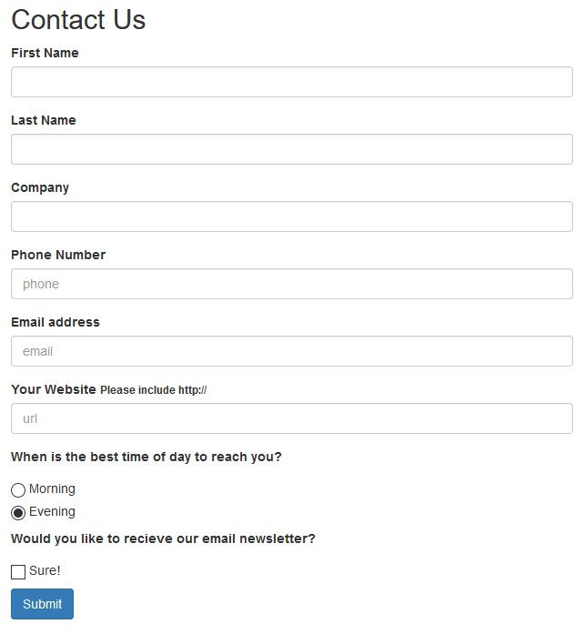

1. [Les programmes dits "Bureau"](#les-programmes-dits-bureau)
   1. [Historique informatique](#historique-informatique)
      1. [Naissance de l'informatique](#naissance-de-linformatique)
      1. [Les langages et leurs niveaux d'abstraction](#les-langages-et-leurs-niveaux-dabstraction)
      1. [L'informatique au quotidien](#linformatique-au-quotidien)
   1. [Le problème de sous-optimisation](#le-problème-de-sous-optimisation)
1. [Les applications mobiles](#les-applications-mobiles)
   1. [Historique mobile](#historique-mobile)
      1. [Les début de l'air nomade](#les-début-de-lair-nomade)
      1. [Les applications](#les-applications)
      1. [Les smartphones au quotidien](#les-smartphones-au-quotidien)
   1. [Pour les entreprises](#pour-les-entreprises)
1. [Les logiciels du Web](#les-logiciels-du-web)
   1. [Historique du web](#historique-du-web)
      1. [Naissance de l'Internet](#naissance-de-linternet)
      1. [Le passage au dynamisme](#le-passage-au-dynamisme)
      1. [Le web au quotidien](#le-web-au-quotidien)
   1. [Les performances](#les-performances)
   1. [Le web sur mobile](#le-web-sur-mobile)
      1. [Le Responsive Design](#le-responsive-design)
1. [La solution multiplateforme](#la-solution-multiplateforme)
   1. [Pourquoi chercher le multiplateforme](#pourquoi-chercher-le-multiplateforme)
   1. [Le multiplateforme bureau](#le-multiplateforme-bureau)
   1. [Le multiplateforme mobile](#le-multiplateforme-mobile)
   1. [Le multiplateforme web](#le-multiplateforme-web)

Les logiciels ont une place très importante dans notre monde depuis plusieurs dizaines d'années et leur importance ne cesse de croître.\
Nous utilisons des appareils électroniques chaque jour et ces logiciels sont notre moyen de communiquer avec la machine, afin de la laisser agir pour notre confort.

Il est donc primordial de rendre ces interfaces le plus accessible possible et continuer d'améliorer leur utilité auprès des utilisateurs.

## Les programmes dits "Bureau"

### Historique informatique

#### Naissance de l'informatique

Lors de la genèse de l'informatique, il n'était pas encore question de portabilité applicative, chaque logiciel devait être développé pour une (et une seule) machine.\
Si un logiciel devait exister sur un ordinateur d'une marque et sur un autre d'un marque différente, il devait être redéveloppé deux fois car le langage machine de ces ordinateurs était tout bonnement différent.

Bien évidemment, ce problème de taille fut rapidement réglé avec l'arrivé des langages de programmation à haut niveau d'abstraction et des systèmes d'exploitations.

#### Les langages et leurs niveaux d'abstraction

Le binaire, cette suite de 0 et 1 indéchiffrable pour un simple être humain, est notoirement connu pour être la première façon qu'un développeur avait de communiquer avec la machine, en altérant comme cela les différences de potentiels au sein de celle ci. C'est avec cette méthode aujourd'hui complètement révolue que les premiers "logiciels" ont pu voir le jour.

En plus d'être extrêmement fastidieux, cette méthode était prône à l'erreur et très délicate. La moindre erreur était complexe à trouver et à corriger.\
Bien évidemment, ce n'est pas avec cette technique que l'apparition en masse des logiciels a pu se faire.

L'arrivé des langages dit "machines" a permit de rendre tout cela bien plus facile. Les langages machines, appelés aussi "assembleur", permettaient de pouvoir relire un code dans un format plus proche de l'anglais, même si un grand fossé sépare ces langages de celui de Shakespeare.

```asm
SUB     AX,AX
MOV     ES,AX
SUB     BH,BH
MOV     BL,INT_NUMBER
SHL     BX,1
SHL     BX,1
MOV     DI,ES:[BX]
MOV     ES,ES:[BX+2]
ADD     DI,4
LEA     SI,TAG
MOV     CX,TAG_LEN
REPE  CMPSB
JE      CALL_CALC
MOV     BX,SCREEN_HANDLE
MOV     CX,MESSAGE_LEN
LEA     DX,MESSAGE
MOV     AH,40h
INT     21h
JMP     SHORT CALC_EXIT
```

> Exemple de code en langage assembleur

Ces langages cependant étaient liés directement aux processeurs qui exécutait les instructions, rendant donc la portabilité du code source impossible, à l'instar du binaire.

Il a fallu attendre l'arrivé d'un plus haut niveau d'abstraction pour faciliter l’écriture du code et sa portabilité par la même occasion. Le concept d'abstraction est un peu complexe a saisir mais peut-être résumé dans ce cas à la hiérarchie des instructions.\
Là ou le code binaire influe directement sur le processeur qui l’exécute, un langage à plus haut niveau d'abstraction passe d'abord dans un compilateur (logiciel spécialisé utilisé exclusivement par les développeurs) qui va le transformer en son équivalent en code assembleur. (Qui lui même passera dans un assembleur pour être transformé en binaire).

C'est cette particularité qui permet à un langage à haut niveau d'abstraction de proposer des fonctionnalités très commune dans une syntaxe plus simple, et qui permet aussi par exemple de rendre un code plus proche d'une langue parlée, facilitant de ce fait la compréhension.\
Cette couche d'abstraction a permis à un langage comme le C par exemple de pouvoir être compilé pour plusieurs sorte de processeurs différent. Avec un seul code source, on pouvait sortir des instructions pour plusieurs machines différentes, c'était le début du code multi-plateforme.

#### L'informatique au quotidien

> Il n'y a aucune raison pour qu'un particulier possède un ordinateur chez lui.

<strong style="text-align: right;">Ken Olsen - 1977</strong>

Contrairement à ce qu'annonçait l'ingénieur Olsen, aujourd'hui, les ordinateurs personnels sont toujours au cœur de notre utilisation de l'informatique, principalement pour leur puissance de calcul et la précision et la rigueur de leur maniement.

Malgré l'essor des smartphones, s'il y a bien un milieu dans lequel les terminaux fixe sont toujours très amplement utilisés, c'est dans les milieux professionnels.\
Les logiciels de gestion ou les logiciels métiers sont bien entendu profusément répandus dans la plupart des professions de toute sorte.

Il ne faut pas non plus mettre de côté la culture des jeux vidéos qui elle aussi est en croissance depuis les années 1980. Même si le marché du jeu vidéo est aussi en plein essor sur les téléphones portables, les ordinateurs de bureau ont toujours une place prépondérante dans ce domaine.

### Le problème de sous-optimisation

Lorsque le développement informatique nécessitait de gérer l'état de la machine à une couche presque *physique*, et qu'il fallait manuellement accéder à des zones de la mémoire vive pour faire fonctionner un logiciel, il était bien évidemment essentiel de passer un temps non négligeable à optimiser le code afin de ne pas surcharger la machine.

Aujourd'hui les ordinateurs ont une puissance de calcul telle qu'il est parfois facile d'oublier le chemin qui a été parcouru.\
On parle de sous-optimisation lorsqu'une application fonctionne normalement, sauf qu'elle est très (parfois trop) gourmande en ressource pour ce qu'elle chercher à accomplir. Le manque de rigueur lié à la gestion des ressources et à l'optimisation du code engendrant donc cette consommation excessive de ressources.\
Cette problématique est assez connue des développeur mais il existe pourtant assez peu de solutions pour y remédier, si ce n'est passer plus de temps à chercher à optimiser le code source d'un logiciel.

D'un autre côté, certains voient d'un bon œil ce problème en montrant que le code écrit aujourd'hui et bien plus facile à lire (et donc à maintenir) qu'il y a des années.\
Si le code représentait autrefois des instructions précises pour indiquer à la machine comment se comporter, aujourd'hui la machine est bien plus à même que nous de savoir comment se comporter. Le code que nous écrivons représente alors de simples *suggestions* et il paraît cohérent de vouloir l'optimiser pour la lecture par les humains, plutôt que pour l'exécution par la machine.

Ces deux faces d'un même pièce représentent un conflit qui existe depuis quelques années dans le monde de la programmation, notamment depuis l'utilisation grandissante du JavaScript, dont nous reparleront plus tard dans la partie consacrée aux application web.

## Les applications mobiles

### Historique mobile

#### Les début de l'air nomade

Propulsé en 2007 avec l'arrivé de l'iPhone de première génération, le marché des téléphones portables intelligent (renommés par la suite *smartphones*) n'a cessé de croître.\
C'est avec la démocratisation de l'usage d'Internet sur les mobiles que grandi cette nouvelle air nomade.
Si en 2010, l'utilisation d'Internet sur un appareil mobile était d'à peine 3%[^1], 10 ans plus tard cela représente maintenant **plus de la majorité** de la consommation d'information du web[^2] !

#### Les applications

Les applications disponibles sur les smartphones on pu bénéficier d'une approche bien différente de celles des logiciels bureau.\
Tout d'abord, leurs utilités était souvent plus restreinte et il fallait posséder plusieurs applications pour faire ce que l'on voulait, poussant à une consommation assez importante d'applicatifs.

Grâce à des "marchés d'application" comme le *Google Play* pour Android et *l'AppStore* pour iOS, il est très aisé de trouver des applications qui peuvent satisfaire nos besoins.\
Même les systèmes d'exploitations bureau comme Windows ou Mac n'ont intégré ces système de que trois ou quatre ans après la première version de l'AppStore. (Linux quand à lui faisant exception avec son gestionnaire de paquet APT, créé en 1998)

Aujourd'hui, cette "frénésie de l'application" se perd petit à petit au profit de logiciels plus poussés, essayant souvent de regrouper en un seul paquet de nombreux utilitaires communs.

#### Les smartphones au quotidien

Les téléphones portables sont aujourd'hui de parfait outils du quotidien et, bien que leur puissance de calcul soit toujours (et irrémédiablement) inférieure à celles des ordinateurs de bureau, ils sont capable de faire fonctionner des applications toujours plus performantes. (Sous la contrainte cependant que ces applicatifs ne soient pas trop demandeur en ressource)

On estime en 2020 que deux tiers des habitant du monde possèdent un téléphone portable[^3]

### Pour les entreprises

Certaines entreprises se sont mises à utiliser des terminaux mobiles (des smartphones mais aussi parfois des tablettes pour profiter de dimensions d'affichage confortables) dans leurs cœurs de métiers. Parfois simplement pour l'aspect communicatif mais aussi pour profiter d'applications qu'il est possible d'embarquer. Par exemple un commercial sur la route serait en mesure de se déplacer avec une version allégé de l'ERP utilisé en interne pour pouvoir accéder à des donnés de son entreprise depuis n'importe où.

Les entreprises ayant le rapport le plus important aux appareils mobiles sont celles qui ont choisi de faire des applications leur priorité et qui s'adresse généralement au plus grand public.\
Pourtant quand on observe les grandes entreprises utilisant des applications mobile pour fournir des services (*Google*, *Uber*, *Facebook* pour ne citer qu'elles), ont remarque qu'elles possède toute une présence plus "fixe" pour les utilisateurs d'ordinateurs.\
Cependant, **aucune n'a de logiciel bureau**. Ces entreprises se basent uniquement sur les versions web de leurs portails pour toucher cette cible.

## Les logiciels du Web

### Historique du web

#### Naissance de l'Internet

À ses premiers pas avec le grand public au début des années 1990, l'Internet avait comme but d'afficher des pages de contenus fixe. On pouvait de ce fait rédiger des articles et les agrémenter de quelques images d'illustration.

Bien évidemment, l'usage d'Internet tel qu'on le connait aujourd'hui est très loin de se résumer à de simples murs de texte. Très nombreuses sont les entreprises à avoir saisi l'opportunité d'Internet en ayant créé des façades visuellement attrayante pour promouvoir leurs produits ou leurs services.

Cependant, en plus des sites qu'on appelle communément "vitrine", certaines entreprises exposent des sites qui proposent directement des services.\
Le plus connu mais aussi le plus souvent négligé est bien sûr le géant *Google* qui, avec son moteur de recherche éminemment célèbre, offre depuis 1998 la possibilité à ses visiteurs de devenirs **utilisateurs** en recherchant la toile à la recherche d'information.

#### Le passage au dynamisme

La première version du web ne possédait aucun moyen de traiter des données de manières dynamique, ni même de moyen pour l'utilisateur d'interagir directement avec le contenu d'une page. Le flux d'information n'allait que dans une seule direction, celle du visiteur.

Plusieurs langage de programmation pour le web sont apparu à partir des années 1990, parmi ceux ci, les deux plus populaire et encore très largement utilisé aujourd'hui sont sorti en 1995, à savoir le *PHP* et le *JavaScript*.

#### Le web au quotidien

Aujourd'hui, un très grand nombre d'applications sont disponibles, leur croissance a été si rapide qu'il est parfois difficile de s'imaginer que l'Internet n'avait pas du tout comme intention de remplacer les logiciels tels qu'il le fait.\
Des moteurs de recherches, aux sites marchands en passant par les galeries en ligne et les réseaux sociaux, notre utilisation quotidienne des applications web est immense et pourtant tout cela nous apparaît généralement comme trivial.

Il est maintenant relativement difficile de trouver une entreprise qui choisisse de faire l'impasse sur la visibilité que pourrait lui apporter une présence sur la toile.\
Au delà de chercher à dégager du revenu avec des méthodes comme la publicité (méthode en déclin de toute manière), être visible parmi les premières pages d'un moteur de recherche permet à un nombre toujours croissant d'utilisateurs de se renseigner et de découvrir l'entreprise en question.

### Les performances

Comme nous en parlions [plus tôt](#le-problème-de-sous-optimisation), certains langages du web souffrent de mauvaise réputation concernant leurs performances, en particulier le *JavaScript*. Il est important de rappeler que contrairement au langages dit "[natifs](/chapters/glossaire#logiciel-natif)", ces langages de script sont exécuté au sein d'un navigateur internet qui lui même est exécuté par le système d'exploitation.\
Cette "double couche" exécutive est malheureusement souvent à la source des ces problèmes de performances.

En plus de cela, d'une manière assez paradoxale, l'accessibilité de ces langages est aussi une source de ce problème.\
Dans le cas du *JavaScript* en particulier, c'est un langage de programmation à la syntaxe relativement aisée à la lecture, ressemblant à beaucoup d'autres langages tout aussi connus (le *Java* pour ne citer que lui). En plus de cela, il ne nécessite pas d'outils particulier pour exécuter, si ce n'est un navigateur Internet.\
Cette facilité d'accès et d'écriture font de ce langage une excellente porte d'entrée pour le développement informatique.

Le problème étant que si beaucoup d'apprentis se sont mis à créer des applications web, la moindre qualité du code a pu se faire ressentir, couplé au [problème de sous optimisation](#le-problème-de-sous-optimisation). Le résultat en est une mauvaise utilisation de l'outil de développement et de mauvaises performances en général au sein des pages web que nous visitons chaque jour.

### Le web sur mobile

Quand les applications mobiles ont explosé en popularité lors de l'avènement des smartphones, il a fallu aussi adapter les pages web déjà existantes pour ces petits écrans dont le ratio était inversé (16:9 pour un écran d'ordinateur commun contre 9:16 pour la plupart des smartphones).

#### Le Responsive Design

Ce changement de forme d'écran pose tout de suite un problème de taille, pratiquement aucun site ne peux afficher son contenu le plus important à l'écran puisque ce contenu est distribué horizontalement.\
Lors d'une navigation sur un écran vertical, seul un faible pourcentage de l'information est disponible à la fois et l'utilisateur se retrouve dans l'obligation de se déplacer constamment dans la fenêtre s'il veut accéder aux informations.

Quand bien même un site afficherais son contenu verticalement, il n'est pas certain que sa largeur sera la même que celle de l'écran qui le visualisera, et si on visite ce site sur un écran d'ordinateur c'est le problème inverse qui se pose, il faudra désormais faire défiler verticalement l'écran plus que de raison afin d'accéder à tout le contenu du site.

Devant ce problème, une seule véritable solution se présente, il fallait un moyen de créer un site qui s’adapterait à toute taille d'écran. Un site qui puisse réagir à la taille de ce dernier, en anglais, un site ***responsive***.

Le *Responsive Design* est un ensemble de pratique visant à rendre expérience d'un utilisateur mobile la plus fluide et pratique possible.\
L'une et potentiellement la plus importante des pratiques est les *media queries* . Cette pratique part d'une base commune; une page avec des sections, des formulaires, des images etc. . A cela elle permet aux développeurs et *designers* d'ajouter des règles d'affichage en fonction de la taille de l'écran.

Pour exemple, un formulaire classique qui s’afficherait sur deux colonnes comme celui ci :


En lui précisant une règle qui défini que s'il doit s'afficher sur un écran dont la largeur est inférieur à 576px (valeur fréquente mais non standard pour définir la largeur d'un écran de smartphone vertical), il devra lister ses champs sur une seule colonne verticalement afin de s'ajuster au mieux à cet écran :



Ce système est très puissant et à son arrivé en Juin 2012[^4] il a révolutionné la façon dont les sites web (et par extension les applications web) pouvait être développé et les cibles qu'ils pouvaient viser.\
Aujourd'hui il n'est pas rare de pouvoir accéder aux sites de grandes sociétés grâce à un smartphone sans que celui ne rencontre de problème d'affichage. C'est même souvent le cas lors de l'utilisation d'une tablette, un "simple" ensemble de règles supplémentaire pour cet éventail de taille d'écran.

## La solution multiplateforme

Devant ces trois grandes familles d'applicatifs, l'une d'entre elle s'est hissé sur le devant de la scène ces dernières années et ce, malgré plusieurs problématique, j'ai bien sûr nommé les applications web et leurs "successeurs spirituels" les applications [*hybrides*](/chapters/glossaire#logiciel-hybride).

### Pourquoi chercher le multiplateforme

L'utilisation de plus en plus fréquente des appareils mobiles ainsi que celle des sites web a poussé de plus en plus d'entreprises à se pencher sur la question du multiplateforme.\
En effet si un logiciel métier peut-être développé pour un parc installé restreint en systèmes d'exploitations, ce n'est pas un luxe que peut se permettre une application grand public ou même un logiciel métier déployé dans un parc de machines non contrôlés. Pour ces derniers cas, il fallait obligatoirement développer une version pour chaque appareil qui pouvait potentiellement être utilisé.

Ce processus de développement était fort long et fastidieux. Dans les cas chanceux où les technologies de développement étaient les mêmes entre les différentes cibles (comprendre : appareil au système d'exploitation différent), il était possible de partager du code (et donc de la fonctionnalité). Pour les autres cas, il fallait parfois recréer des fonctionnalités existantes dans un langage de programmation différent, entrainant de ce fait une importante montée du temps de développement et donc des coûts associés.

Devant cette problématique de taille, la stratégie la plus souvent employée était de développer le logiciel pour la cible la plus prolifique seulement afin de maximiser les revenus par rapport aux coûts de productions.\
Cependant on peux remarquer que cette stratégie se contente de contourner le problème plutôt que d'y répondre.

### Le multiplateforme bureau

Pour répondre à cette problématique, les ingénieurs développeurs ont cherchés à trouver le moyen de partager le code source entre plusieurs cibles, voir à utiliser la même *codebase* (code source complet d'un projet particulier, là où le code source n'en représente potentiellement qu'une partie).\
Comme précisé [plus haut](#les-langages-et-leurs-niveaux-dabstraction), c'est avec l'arrivé de langages à plus haut niveau d'abstraction que l'on a pu commencer à porter des applications entre les différents systèmes d'exploitations les plus populaires (Windows, Linux et MacOS). Cependant avec la diversité croissante des technologies disponible, et l'apparition de langages à niveau d'abstraction encore plus élevé, cette portabilité a fini par s'estomper.

Aussi contre-intuitif cela puisse-t-il être, lorsqu'on base un outil sur une autre qui se base lui même sur un autre, en plus de créer un outil plus performant, on risque de le rendre dépendant d'une multitude de détails qui l'empêche d'être utilisé avec d'autres outils.\
C'est le cas de certains langages qui, pour pallier cela, nécessitent de posséder leur compilateur (ou interpréteur, voir glossaire) installé sur la machine cible (Java, C#, Python etc.).

<div class="mermaid">
graph TD
  F[Langage à abstraction encore plus élevée]
  F -->|Compile| E
  F -->|Interprète| E
  F -->|Transpile| E
  E[Langage à haut niveau d'abstraction]
  E -->|Compile| D
  E -->|Interprète| D
  E -->|Transpile| D
  D[Langage à bas niveau d'abstraction]
  D -->|Compile| C
  C[Langage assembleur]
  C -->|Assemble| B
  B[Code Binaire]
  B -->|Contrôle| A
  A[Couche matérielle]
</div>

> Schéma des couches d'abstractions

Et si les fonctionnalités dites "[*back-office*](/chapters/glossaire#backend--back-office)" ou communément "*back*" (comprendre : les calculs et les opérations effectués en arrière plan) ne sont dépendantes de rien de plus que ce compilateur, les fonctionnalités dites "[*front-office*](/chapters/glossaire#frontend--front-office)" ou "*front*" (comprendre : l'affichage de l'interface utilisateur et sa gestion) en revanche sont très dépendantes des technologies embarquées dans le système d'exploitation.\
En effet, si le *back* représente 50% des fonctionnalités d'une application, le *front* représente alors les cinquante autres pour cents. Dès lors il est nécessaire d'utiliser des technologies communes aux systèmes d'exploitations que l'on cible si l'on désire pouvoir partager un maximum de code.

### Le multiplateforme mobile

Au début des ordinateurs de bureau, la rivalité entre les producteurs de systèmes d'exploitations ne connaissait pas l'ampleur qu'elle connait aujourd'hui. C'est aussi grâce a cela en partie que la portabilité du code bureau est si démocratisé.\
Cependant, au début des smartphones, cette rivalité pouvait déjà plus se faire ressentir et couplé aux langages à haut niveau d'abstraction, la route fut scindé entre les deux leaders du marché.

D'un coté Apple avec son iOS, se base sur une distribution (= version) de Linux appelée Darwin pour en faire un système d'exploitation propriétaire (voir glossaire) et requière des développeurs de concevoir les applications en *Objective-C* (Ancien langage de programmation de 1984, remplacé en 2014 par le langage *Swift*).\
De l'autre côté, Google acquière Android en 2005. Ce système d'exploitation se base aussi sur Linux mais reste libre de droit (voir glossaire), les applications devant être développé en *Java* (Puis potentiellement *Kotlin* en 2017).

Ces différences de langage amène une scission entre les deux marques de smartphones et le code n'a donc plus rien de multiplateforme, une application développée pour Android devrait être entièrement re-développée si une sortie sur iOS est envisagée. Même le travail de conception visuel devra être revu étant donné les lignes directrices d'interface utilisateur que chaque entreprise recommande pour ses appareils. (Pour Google et Apple il s'agit de *Material Design*[^5] et de *Human Interface*[^6] respectivement).

### Le multiplateforme web

La technologie du web, par sa nature d'être affichée par le biais d'un navigateur internet, et le nombre conséquents de système d'exploitation possédant un navigateur intégré, deviens *de facto* le système de restitution d'applicatif le plus multiplateforme.

L'unique problème de ce point de vue concernant les applications web sont justement les navigateurs, et plus particulièrement ce qu'on appelle leurs *moteurs*. Le moteur d'un navigateur représente la technologie qui lui permet d'afficher une page web, et d’exécuter son code JavaScript.\
Un navigateur comme Google Chrome utilise un moteur nommé *Blink*, basé sur un moteur précédent appelé *WebKit*. Mozilla de son coté avec Firefox utilise *Gecko*. De son coté Apple et son navigateur Safari utilise toujours l'ancien moteur *WebKit*.

Ces moteurs, bien qu'indiscernables pour les utilisateurs profanes, possèdent des différences dans leurs manière d’appréhender la restitution d'une page web.\
Malgré cette problématique, user de quelques subtilités techniques permet de contourner la plupart des limitations et de rendre le code compatible avec un grand nombre de navigateurs modernes.

[^1]: [Statcounter 2010](https://gs.statcounter.com/platform-market-share/desktop-mobile-tablet/worldwide/2010)
[^2]: [Statcounter 2020](https://gs.statcounter.com/platform-market-share/desktop-mobile-tablet/worldwide/2020)
[^3]: [Data Reportal](https://datareportal.com/global-digital-overview)
[^4]: [W3 org](https://www.w3.org/standards/history/css3-mediaqueries)
[^5]: [Material Design](https://material.io/design/introduction#color-usage-and-palettes)
[^6]: [Human Interface](https://developer.apple.com/design/human-interface-guidelines/ios/overview/themes/)
