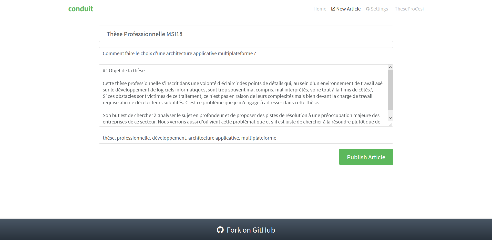

1. [Objet de la thèse](#objet-de-la-thèse)
1. [Contexte](#contexte)
1. [Problématique](#problématique)
1. [Cibles visées](#cibles-visées)
1. [Hypothèses proposées](#hypothèses-proposées)
   1. [Première hypothèse](#première-hypothèse)
   1. [Deuxième hypothèse](#deuxième-hypothèse)
   1. [Troisième hypothèse](#troisième-hypothèse)
   1. [Quatrième hypothèse](#quatrième-hypothèse)
   1. [Cinquième hypothèse](#cinquième-hypothèse)
1. [Démarche proposée](#démarche-proposée)
   1. [Qu'est ce qu'un *proof of concept*](#quest-ce-quun-proof-of-concept)
   1. [Les critères](#les-critères)
      1. [**Critères 1** : Pendant le développement](#critères-1--pendant-le-développement)
         1. [**Critère 1.1** : Le temps de développement](#critère-11--le-temps-de-développement)
         1. [**Critère 1.2.1** : Les limitations des technologies](#critère-121--les-limitations-des-technologies)
         1. [**Critère 1.2.2** : Les limitations esthétiques](#critère-122--les-limitations-esthétiques)
      1. [**Critères 2** : Après le développement](#critères-2--après-le-développement)
         1. [**Critères 2.1** : Le déploiement](#critères-21--le-déploiement)
         1. [**Critères 2.2** : La maintenance](#critères-22--la-maintenance)
         1. [**Critères 2.3** : La réutilisation](#critères-23--la-réutilisation)
      1. [**Critères 3** : Le résultat](#critères-3--le-résultat)
         1. [**Critère 3.1** : Utilisation du processeur et de la mémoire](#critère-31--utilisation-du-processeur-et-de-la-mémoire)
         1. [**Critère 3.2** : Temps de réponse moyen](#critère-32--temps-de-réponse-moyen)
         1. [**Critère 3.3** : Le poids de l'exécutable](#critère-33--le-poids-de-lexécutable)
      1. [Comparaisons des critères entres eux](#comparaisons-des-critères-entres-eux)
   1. [RealWorld](#realworld)
      1. [Conduit](#conduit)
         1. [Les fonctionnalités](#les-fonctionnalités)
         1. [Visuels application bureau](#visuels-application-bureau)
         1. [Visuels application mobile](#visuels-application-mobile)
   1. [Précisions sur les mesures](#précisions-sur-les-mesures)
1. [Valeur ajoutée de cette recherche](#valeur-ajoutée-de-cette-recherche)

## Objet de la thèse

Cette thèse professionnelle s'inscrit dans une volonté d'éclaircir des points de détail qui, au sein d'un environnement de travail axé sur le développement de logiciels informatiques, sont trop souvent mal compris, mal interprétés, voire tout à fait mis de côtés.\
Si ces obstacles sont victimes de ce traitement, ce n'est pas en raison de leurs complexités mais bien devant la charge de travail requise afin de déceler leurs subtilités. C'est ce problème que je m'engage à adresser dans cette thèse.

Son but est de chercher à analyser le sujet en profondeur et de proposer des pistes de résolution à une préoccupation majeure des entreprises de ce secteur.

## Contexte

Lorsque j’écris cette thèse, je suis actuellement en poste dans une entreprise de développement de logiciels sur mesure. Je suis donc un développeur comme plus de vingt-six millions de personnes dans le monde[^1], et comme eux, je suis sans cesse à la recherche **d'optimisation**.\
Le désir constant d'optimisation peut être perçu comme la lutte continuelle pour l'amélioration d'un fonctionnement, pour la minimisation des contraintes et des coûts pour mener à bien une activité.

Dans mon (notre) cas de figure, au sein de sociétés dont le but est de fournir à ses clients des logiciels capables de répondre à leurs besoins les plus directs, cette optimisation est bien entendu fondamentale. Il faut chercher à limiter le temps de réponse de l'entreprise pour adresser les besoins du client. Lui-même demandant une solution informatique très souvent dans l'optique d'optimiser son propre temps de production ou de réponse.\
Le temps n'est d'ailleurs bien souvent pas la seule contrainte que l'on cherche à optimiser, le budget est aussi très sollicité. De toute manière, il n'y a pas de contraintes que l'on ne désirerait pas réduire à zéro.

Le métier de développeur est en cela le plus à même d'amener des pistes de réflexion sur l'optimisation étant donné la nature même du travail. Les ingénieurs logiciels font de la résolution de problèmes et de la vitesse ainsi que de l'efficacité de ces résolutions un enjeu premier.\
Dans un cœur de métier aussi technique, il est donc normal d'avoir une multitude d'outils dont le but premier est la minimisation des coûts et des obstacles, et la maximisation de la qualité du résultat.

Il existe un principe de programmation très employé qui cristallise une facette de l'optimisation, à savoir le principe *DRY*.\
*DRY*, pour *Don't Repeat Yourself*, soit littéralement "Ne vous répétez pas", est un rappel constant aux développeurs de ne pas réécrire du code qui a déjà été écrit auparavant. Souvent on entend "si vous devez écrire plus de deux fois la même chose, c'est que vous pouvez mieux faire", ou pour reprendre les mots d'Andy Hunt et Dave Thomas[^2], initiateurs du principe *DRY* :

> Dans un système, toute connaissance doit avoir une représentation unique, non-ambiguë, faisant autorité.

## Problématique

Parmi les nombreuses raisons de chercher à optimiser et à "ne pas se répéter" lorsque l'on développe une application, il y en a une qui s'avère être depuis bien longtemps particulièrement chronophage et par conséquent, onéreuse.\
Pour qu'un logiciel puisse être disponible pour le plus grand nombre, il faut que celui-ci puisse s'exécuter sur un grand nombre d'appareils tous bien différents. La forme de l'écran, les performances de la machine, la méthode de saisie, tous ces paramètres sont à prendre en compte et il faut parfois redévelopper une application identique à l'aide d'un autre langage de programmation si l'on veut une version compatible.

Devant cela bien sûr, le principe *DRY* est violé et, par là même, l'optimisation devient très compliquée.\
Nous pouvons donc nous demander :

> Comment faire le choix d'une architecture applicative multiplateforme ?

Cette problématique n'est pas seulement à propos de "comment", dans le sens technique du terme mais aussi de "faut-il" ou même "est-il possible".

En effet si une application peut être développée une seule fois et être compatible avec un grand nombre d'appareils différents, cela peut apporter une grande valeur ajoutée. Mais si ce développement est bien plus complexe et coûteux (en budget mais aussi en temps), l'effort vaut-il le coup ?

L'effort lui-même, est-il envisageable au vu des technologies actuelles ? Existe-t-il un ou plusieurs outils à même de répondre au besoin de portabilité d'une architecture applicative ?

## Cibles visées

Cette question brasse un champ bien trop vague des possibles pour pouvoir en extraire une réponse valable pour tous les appareils informatiques existants.\
Aussi nous allons réduire la portée de notre recherche aux systèmes d'exploitation les plus populaires aujourd'hui, chez les particuliers comme chez les professionnels.

Ces systèmes d'exploitation peuvent être groupés en deux catégories de supports physiques à savoir les terminaux fixes et mobiles :

- Terminaux fixes :
  - Linux
  - Microsoft Windows (à partir de la version 7[^3])
  - macOS (OSX)
- Terminaux mobiles (smartphones) :
  - Android
  - iOS

Ces cinq systèmes d'exploitation seront notre principale préoccupation étant donné qu'ils représentent ensemble plus de 95%[^4] de l'utilisation de machines informatiques.

## Hypothèses proposées

Devant cette problématique, nous pouvons émettre plusieurs hypothèses afin de tenter de répondre à la question posée.\
Chaque hypothèse propose une piste de réflexion prenant en compte les subtilités techniques ainsi que les risques de chaque technologie.

### Première hypothèse

Tout d'abord, afin de partir d'une hypothèse qui semblerait évidente, et qui aura pour but d'être comparée avec d'autres hypothèses plus recherchées, nous pouvons annoncer cette solution potentielle :

> Une application native pour chaque appareil cible.

De ce fait, cette hypothèse servira de "témoin" puisqu'elle ne nécessite pas de travaux de recherche particuliers et se contente de l'existant pour répondre à la problématique posée.\
C'est en comparant les résultats de cette hypothèse aux autres que nous pourrons déterminer l'utilité de cette recherche de solutions, ainsi que le bien-fondé de la problématique.

graph TD
    CS1((Code)) --> UI1(Interface) -->|Application native| MC1[Linux]
    CS2((Code)) --> UI2(Interface) -->|Application native| MC2[Windows]
    CS3((Code)) --> UI3(Interface) -->|Application native| MC3[OSX]
    CS4((Code)) --> UI4(Interface) -->|Application native| MC4[Android]
    CS5((Code)) --> UI5(Interface) -->|Application native| MC5[iOS]

> Schéma d'un exemple de cette hypothèse

### Deuxième hypothèse

> Séparer les cibles en deux grands groupes, à savoir "Logiciels Bureaux" et "Applications Mobiles" et faire deux applications natives différentes pour ces groupes.

En limitant les applications, le temps de développement se retrouve lui aussi réduit. Si nous nous concentrons sur deux groupes de cibles il n'y a alors que deux codes sources à créer et à maintenir. Leurs deux langages de programmation étant très probablement différents, les fonctionnalités seront donc écrites deux fois mais on peut facilement imaginer que c'est un coût supplémentaire éclipsé par les performances des applications ainsi que leurs possibilités.

graph TD
    subgraph Mobile
        CS2((Code))
        UI2(Interface)
        MC4[Android]
        MC5[iOS]
        CS2 --> UI2 -->|Application Native| MC4 & MC5
    end
    subgraph Bureau
        CS1((Code))
        UI1(Interface)
        MC1[Linux]
        MC2[Windows]
        MC3[OSX]
        CS1 --> UI1 -->|Application Native| MC1 & MC2 & MC3
    end

> Schéma d'un exemple de cette hypothèse

### Troisième hypothèse

> Une seule application web et une interface *responsive* pour tous les appareils cibles.

Les applications web peuvent tourner sur n'importe quel appareil doté d'un navigateur internet. Le responsive design permet d'afficher un site sur toute taille d'écran. Il devrait donc être possible d'avoir une seule application web qui puisse être déployée sur une multitude de supports compatible tout en ne gardant qu'un seul code source.\
Cette solution potentielle se rapproche de la deuxième hypothèse dans sa limitation des coûts et son optimisation de la quantité du code.

graph TD
    CS1((Code))
    UI1(Interface)
    MC1[Linux]
    MC2[Windows]
    MC3[OSX]
    MC4[Android]
    MC5[iOS]
    CS1 --> UI1 -->|Application Web| MC1 & MC2 & MC3 & MC4 & MC5

### Quatrième hypothèse

> Une application web pour les cibles bureau et une application native dans le même langage pour le cibles mobiles

Cette hypothèse possède une grande similitude avec l'hypothèse précédente, à la différence près que l'application mobile est native.\
En effet il existe de plus en plus d'outils permettant aux développeurs d'applicatifs web de contraindre certaines de leurs possibilités pour permettre la création d'un logiciel natif à l'aide d'un code source pour logiciels web.

Parmi ces outils on en retrouve trois très populaires qui utilisent les trois [*frameworks*](/chapters/glossaire#framework) web les plus connus à savoir :

- *React Native* pour React
- *Ionic* pour React, Angular et Vue
- *NativeScript* pour Angular et Vue

Ces outils permettent de partager une grande quantité de code depuis d'autres projets Javascript et ne requièrent la modification que de la partie interface utilisateur.\
Dans le cas où les développeurs font le choix de commencer avec l'un de ces outils, ils peuvent réutiliser 100% du code pour faire une application web sur bureau et native sur mobile.

graph TD
    CSP(Code Partageable) <--> CS1 & CS2
    subgraph Mobile
      CS1((Code)) --- UI2(Interface)
      MC4[Android]
      MC5[iOS]
      APP1[Application Native]
      UI2 --- APP1  --> MC4 & MC5
    end
    subgraph Bureau
      CS2((Code)) --- UI1(Interface)
      MC1[Linux]
      MC2[Windows]
      MC3[OSX]
      APP2[Application Web]
      UI1 --- APP2 --> MC1 & MC2 & MC3
    end

### Cinquième hypothèse

> Une application hybride pour les cibles bureau et une application hybride pour les cibles mobiles

Grâce au langage de programmation commun (Javascript), il est possible de partager un maximum de code entre les deux applications tout en gardant les spécificités de l'affichage sur grand et petit écran. De plus l'application hybride permet d'accéder à plus de fonctionnalités du système d'exploitation et à mieux se fondre dans l'écosystème d'application de l'utilisateur.

graph TD
    CS1((Code))
    CS1 --- UI1 & UI2
    subgraph Mobile
      UI2(Interface)
      MC4[Android]
      MC5[iOS]
      APP1[Application Hybride]
      UI2 --- APP1  --> MC4 & MC5
    end
    subgraph Bureau
      UI1(Interface)
      MC1[Linux]
      MC2[Windows]
      MC3[OSX]
      APP2[Application Hybride]
      UI1 --- APP2 --> MC1 & MC2 & MC3
    end

## Démarche proposée

Afin de vérifier nos hypothèses et s'assurer du résultat des solutions proposées, nous allons mettre en place une démonstration de faisabilité, souvent appelé par les développeurs un *Proof of Concept* (littéralement "preuve de concept").\

### Qu'est ce qu'un *proof of concept*

Ces *proofs of concept* sont de petites démonstrations techniques mêlant plusieurs technologies au sein d'une application dont l'usage se rapproche au plus près possible d'une réelle application "métier", tout en conservant une portée réduite (démonstration oblige).

Cette méthode permet, lorsque son utilisation est correcte, d'effectuer des mesures sur un panel de critères aussi complet que possible afin de pouvoir confronter les résultats des différentes hypothèses.\
Afin que chaque relevé soit aussi assimilable aux autres que possible, il faut que les *proofs of concept* suivent tous des règles communes. Il faut, si possible, que chacun d'eux soit une itération d'une même application, dans des technologies différentes.

### Les critères

Les critères de jugement sont multiples et s'appliquent tous à des parties cruciales d'une application réelle.\
Nous scinderont ces critères en trois grandes parties afin de simplifier au mieux la lecture et la compréhension.

Il est important de rappeler que nous ne jugeront pas ici des technologies de construction d'application (*frameworks*) mais uniquement de leurs imbrications.

#### **Critères 1** : Pendant le développement

Ces critères sont des mesures des problématiques encourues lors de la phase de conception d'une application. Ils se rapportent principalement aux développeurs et aux obstacles qui leurs font face tout au long du développement.

##### **Critère 1.1** : Le temps de développement

L'un des critères les plus importants, tant aux yeux des développeurs qu'à ceux des managers, des responsables et des clients, c'est bien entendu le temps qu'une application met à être produite.\
Ce temps, mesuré en heures/homme se devra d'être aussi court que possible afin de limiter les coûts salariaux et de répondre au plus vite au besoin client.

##### **Critère 1.2.1** : Les limitations des technologies

Une application native possède, par définition, un accès complet aux fonctionnalités qu'offre le système d'exploitation sur lequel il s'exécute, sous réserve qu'il possède les droits nécessaires.\
Une application web en revanche n'a pas ces accès et souvent il existe certaines fonctionnalités inaccessibles qui brident ce qu'il est possible de faire pour l'utilisateur.

Ces limitations peuvent se révéler cruciales pour une application métier et même s'il est souvent possible pour les développeurs de les contourner, il faut tout de même prendre cela en compte lors du comparatif des solutions.

Pour mesurer ce critère, nous utiliserons un système de note arbitraire en fonction de différents sous-critères liés à celui-ci.

##### **Critère 1.2.2** : Les limitations esthétiques

Les limitations peuvent aussi se faire sentir du point de vue du design global de l'application.\
Le design, bien qu'étant souvent perçu comme étant non obligatoire et parfois même superflu, peut s'avérer très important dans le cas de projets visant à créer une application agréable d'utilisation.\
Pour en juger, nous considèrerons les possibilités offertes par la technologie employée pour permettre une grande liberté esthétique.

#### **Critères 2** : Après le développement

Ces critères se rapportent eux, à ce qui se passe une fois qu'une application est développée, qu'elle soit finie ou non. Nous allons donc nous intéresser à la livraison du produit, sa maintenance et l'optimisation des ressources en cas de réutilisation du code.

##### **Critères 2.1** : Le déploiement

Le déploiement fait référence au moment où un logiciel est mis à la disposition des utilisateurs. Dans le cas d'un logiciel métier, cela peut se référer à la méthode d'envoi de celui-ci au client, et à la façon dont les utilisateurs finaux pourront l'utiliser. Dans le cas d'une application grand publique, c'est la méthode de distribution de celle-ci au monde entier.

Ce critère se base sur la simplicité du déploiement et les limitations possibles, mesurées toutes deux sur une note arbitraire.

##### **Critères 2.2** : La maintenance

Une fois qu'un logiciel est déployé sur un grand nombre d'appareils, il est important de juger de la souplesse avec laquelle il est possible de le mettre à jour (périodiquement, ou "dans l'urgence") ainsi que l'impact que cette maintenance a sur les utilisateurs. Une bonne mise à jour ne doit pas interrompre le travail de l'usager.

Pour mesurer ce critère, nous jugerons différents sous-critères liés à celui-ci avec des notes arbitraires.

##### **Critères 2.3** : La réutilisation

Toujours dans un souci d'optimisation, il est très bénéfique pour une société de développement informatique de pouvoir compter sur des fonctionnalités qui existent déjà dans des projets, pour les utiliser dans des projets à venir. C'est cette réutilisation du code qui permet à une entreprise d'être de plus en plus performante et de pouvoir répondre aux besoins en un temps optimal.

Le code n'est pas la seule chose qui puisse être réutilisée, des morceaux de l'interface utilisateur sont aussi recyclables selon les technologie utilisées.

Pour mesurer ce critère, nous évaluerons les mécanismes qui permettent de rendre du code réutilisable.

#### **Critères 3** : Le résultat

Enfin, ces derniers critères visent à juger de/des application(s) une fois que leur développement est terminé. Contrairement aux critères précédents, on regarda plutôt ici certaines caractéristiques techniques qu'on comparera d'un point de vue simplement mathématique. Ces caractéristiques seront les résultats de *benchmarks*, des évaluations précise des critères.

##### **Critère 3.1** : Utilisation du processeur et de la mémoire

Les performances d'une application sont un ensemble de mesures qui touchent à sa consommation de ressources. Afin de s'exécuter convenablement, un logiciel doit utiliser la puissance de calcul du processeur et stocker/récupérer des données dans la mémoire vive de l'appareil.\
Une application trop gourmande en ressources aura donc tendance à "fatiguer" la machine, qui peinera donc à faire fonctionner l'application, ou les autres processus de l'appareil.

Même si la consommation de ressources est importante pour tous les supports matériels, c'est le cas des applicatifs mobiles qui est le plus critique en raison des faibles performances des smartphones, comparés aux performances des ordinateurs.

Le but étant de comparer chaque hypothèse sur la même base, nous allons donc établir une liste de moments où nous mesureront l'utilisation du processeur et celle de la mémoire.\
Ces moments se basent sur la forme des *proofs of concept* en question. Pour plus d'informations sur la nature de l'application de test, veuillez vous référer au passage listant [ses fonctionnalités attendues](#conduit).

Voici donc les différents instants du cycle d'utilisation de l'application où nous effectuerons nos relevés :

- Ouverture de l'application et arrivée sur la liste des articles
- Tri des articles par l'utilisation des *tags* (étiquettes) sur cette même page
- Ouverture de la page d'un utilisateur
- Connexion à l'application
- Publication d'un article
- Suppression d'un article

Ces performances sont mesurables et quantifiables grâce à des outils d'analyse.

##### **Critère 3.2** : Temps de réponse moyen

On juge une application agréable quand elle "répond au doigt et à l’œil", en d'autres termes : quand celle-ci réagit aux interactions de l'utilisateur dans un temps très restreint. Si un logiciel met plusieurs secondes à sauvegarder un document (par exemple), on jugera l'application lente.

Cette problématique peut même se faire ressentir quand toutes les actions ont un délai de quelques millisecondes. Même si l'utilisateur ne s'en rend pas tout de suite compte, l'application dégagera une impression de lenteur et de frustration.

Le temps de réponse peut être mesuré en obtenant la différence de temps entre une action de l'utilisateur et la réponse visible à l'écran de cette dernière.\
Il est aussi intéressant de calculer le *First Contentful Paint* ou premier affichage de contenu : le temps que met une application à afficher pour la première fois la page que verra l'utilisateur.

De même, ces relevés se feront sur les mêmes instants du cycle d'utilisation de l'application que pour le [critère 3.1](#critère-31--utilisation-du-processeur-et-de-la-mémoire).

##### **Critère 3.3** : Le poids de l'exécutable

Le dernier critère, le plus aisé à mesurer, est le poids final de l'application.\
À l'inverse du code source, dont la taille n'a finalement que peu d'importance, le poids du logiciel qui devra loger sur la machine d'un utilisateur lui est plus capital. Encore une fois c'est les smartphones et autres appareils mobiles qui sont les plus concernés en raison de leurs espaces de stockage relativement restreints en comparaison avec les appareils fixes.

#### Comparaisons des critères entres eux

Ces critères se basent sur des notations différentes : notes, temps, pourcentages, mesures etc.\
Afin de réduire ces notations à un pied d'égalité et de pouvoir comparer chaque hypothèse entre elles par la somme de ses résultats, nous appliquerons une formule mathématique qui dégagera au final pour chaque hypothèse un nombre de points sur cent.

Ces points auront pour intérêt de comparer les hypothèses entre elles mais il faut garder à l'esprit que cette méthode permet d'avoir un bon aperçu mais n'est en aucun cas un moyen de juger la finalité des hypothèses. Chacune aura des forces et des faiblesses distinctes qu'il faudra apprécier selon leur contexte.

<!-- TODO: Parler de la formule ou pas -->

### RealWorld

Afin de rester dans un contexte technique, et de profiter au mieux du milieu du développement de logiciels et de la vision qui l'entoure, nous allons baser nos travaux sur *RealWorld*[^5].

*RealWorld* est un dépôt de code qui regroupe plusieurs *proofs of concept* cherchant à reproduire une même application avec des technologies différentes.\
L'application en question est un clone de *Medium*[^6], un site web d'articles sur des sujets divers, appelé *Conduit*.

Pour que chaque itération de *Conduit* soient comparables entre elles, elle doivent toutes suivre les même consignes, le même cahier des charges technique.\
L'application est donc scindée en deux parties toujours interchangeables, d'un côté la partie interface utilisateur et de l'autre la gestion des données.

Baser les *proofs of concept* de cette thèse sur *RealWorld* permet de mettre en pratique ce dont nous parlions dans le [contexte](#Contexte), à savoir le désir de ne pas répéter les mêmes travaux que ceux qui existent déjà. Nous cherchons à réutiliser l'existant au profit de nouvelles créations.\
De plus, *RealWorld* étant un travail *open source*, donc libre de droit, il est en parfait accord avec le format de cette thèse qui l'est tout autant, c'est une vision commune dans le monde du développement de logiciels qui mérite d'être partagé.

#### Conduit

Pour mieux présenter *Conduit* et donc la profondeur de notre application de démonstration, voici une liste des actions qu'il doit être capable de faire, ainsi quelques visuels pour aider à appréhender sa forme.

##### Les fonctionnalités

- Authentification
  - Connexion
  - Inscription
- Lecture d'articles
  - Flux global
  - Flux d'auteurs
  - Recherche par étiquettes
  - Partage d'articles
- Écriture d'articles
  - Titre
  - Sous Titre
  - Corps en texte riche ([Markdown](/chapters/glossaire#markdown))
  - Étiquettes

##### Visuels application bureau

##### Visuels application mobile

### Précisions sur les mesures

Bien entendu, puisque les *proofs of concept* se reposeront sur une base de travail déjà effectué à différents niveaux, il ne sera pas possible de baser la mesure du temps de développement sur ma propre quantité de travail uniquement.\
Afin de pouvoir estimer au plus précis le temps de travail déjà effectué par la communauté open source, nous allons nous servir d'un outil.

Dans le monde du développement de logiciels, il est coutume d'utiliser un outil dit "de *versionning*" afin de pouvoir travailler à plusieurs en parallèle sur un même projet et de gérer les différentes versions de l'application.\
Parmi ces outils de versionning, le plus connu est *Git* et c'est celui qui est utilisé dans le dépôt de code de *RealWorld*.\
Sans rentrer dans des détails qui n'apporteraient pas grand-chose à la thèse, il est important d'expliquer rapidement le fonctionnement de *Git* afin de comprendre comment il est possible d'estimer du temps de travail passé.

Quand un développeur change des fichiers, Git retient la liste des changement, en comparaison avec les fichiers tels qu'ils étaient avant que le développeur ne se mette à travailler. Lorsqu'il décide qu'il a fini sa tâche, il peut choisir de *commit* (littéralement "créer un engagement", sous-entendu de modification) et de donner un nom à ces changements afin de les catégoriser.(Exemple : "Ajoute la fonctionnalité de recherche des utilisateurs").\
Ce *commit* est horodaté et le développeur peut passer à une autre tâche, effectuer les modifications nécessaires, les *commit* à nouveau etc.

Il existe donc une ligne du temps sur laquelle tous les *commits* sont positionnés. Cependant ils indiquent tous un endroit dans le temps et non pas une durée de travail. À l'aide d'un algorithme, il est possible de récupérer ces commits et de les grouper ensemble pour reconstituer une "période de travail".

Par exemple, si un développeur crée ces commits à ces moments :

graph LR
  C1(Commit 1 - 09:00)
  C2(Commit 2 - 10:30)
  C3(Commit 3 - 11:20)
  C4(Commit 4 - 13:00)
  C5(Commit 5 - 15:30)
  C6(Commit 6 - 16:30)
  C7(Commit 7 - 17:30)
  C1 --> C2 --> C3 --> C4 --> C5 --> C6 --> C7

On peut lier les *commits* qui se déroulent à moins de 2h d'écarts, et ainsi dégager les deux périodes de travail de la journée. Il suffit ensuite de mesurer l'écart de temps entre le premier et le dernier *commit* de la période.

graph LR
  subgraph Période 1 - 4h
    C1(Commit 1 - 09:00)
    C2(Commit 2 - 10:30)
    C3(Commit 3 - 11:20)
    C4(Commit 4 - 13:00)
  end
  subgraph Période 2 - 2h
    C5(Commit 5 - 15:30)
    C6(Commit 6 - 16:30)
    C7(Commit 7 - 17:30)
  end
  C1 -->|1h30m| C2 -->|50m| C3 -->|1h40m| C4 -->|2h30m| C5 -->|1h| C6 -->|1h| C7

Le problème c'est qu'il n'existe pas de manière de savoir à quel moment le développeur a commencé à travailler. Nous n'avons que son premier jalon (à 9h).\
Afin d'affiner un peu plus nous pouvons ajouter par défaut une heure de travail à chaque période ce qui donnerait dans cet exemple, une journée de 8h, ce qui semble tout à fait cohérent.

C'est cet algorithme qui va pouvoir nous permettre d'estimer au mieux le temps de travail effectué sur un dépôt de code open source.

## Valeur ajoutée de cette recherche

Le but de ce travail de recherche est de fournir au sein d'un document synthétique un grand nombre de comparaisons entre plusieurs architectures applicatives fréquemment utilisées. Ces comparaisons ont pour objectif d'aider au choix de la technologie au lancement d'un projet de développement informatique et d'accompagner le changement de ces technologies au sein d'une entreprise.

Plutôt que de fonder les réponses aux hypothèses sur les jugements subjectifs de développeurs, cette thèse aborde ce sujet d'un point de vue technique grâce aux *proofs of concept* et aux *benchmarks* qui leurs sont liés.\
Malgré cela, aucune réponse définitive ne saurait être apportée. Les solutions ont toujours des exceptions dans lesquelles elles brillent plus et le monde du développement de logiciels est en constante croissance, amenant de ce fait de nouveaux outils et de nouvelles solutions très fréquemment.\

C'est au sujet de ce dernier point que ce travail de recherche ne vise donc pas une réponse unique mais plutôt un conseil quant à l'état d'esprit à avoir lorsque l'on considère une architecture applicative. Si les technologies évoluent à une vitesse extraordinaire, les concepts et les notions d'architecture elles, restent toujours valables selon la nature d'un projet.

[^1]: [SlashData 2019](https://slashdata-website-cms.s3.amazonaws.com/sample_reports/EiWEyM5bfZe1Kug_.pdf)
[^2]: *The Pragmatic Programmer*, Addison-Wesley, 2000
[^3]: [Fin du support de Windows XP : 2009](https://docs.microsoft.com/en-us/lifecycle/products/windows-xp)
[^4]: [StatCounter 2019](https://gs.statcounter.com/os-market-share/all/worldwide/2019)
[^5]: [RealWorld](https://github.com/gothinkster/realworld)
[^6]: [Medium](https://medium.com/)
