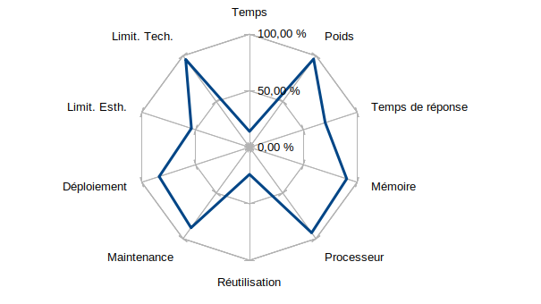

1. [Hypothèse 1](#hypothèse-1)
   1. [Hypothèse 1 - Présentation du *proof of concept*](#hypothèse-1---présentation-du-proof-of-concept)
   1. [Hypothèse 1 - **Critères 1** : Pendant le développement](#hypothèse-1---critères-1--pendant-le-développement)
      1. [Hypothèse 1 - **Critère 1.1** : Le temps de développement](#hypothèse-1---critère-11--le-temps-de-développement)
      1. [Hypothèse 1 - **Critère 1.2** : Les limitations des technologies](#hypothèse-1---critère-12--les-limitations-des-technologies)
   1. [Hypothèse 1 - **Critères 2** : Après le développement](#hypothèse-1---critères-2--après-le-développement)
      1. [Hypothèse 1 - **Critères 2.1** : Le déploiement](#hypothèse-1---critères-21--le-déploiement)
      1. [Hypothèse 1 - **Critères 2.2** : La maintenance](#hypothèse-1---critères-22--la-maintenance)
      1. [Hypothèse 1 - **Critères 2.3** : La réutilisation](#hypothèse-1---critères-23--la-réutilisation)
   1. [Hypothèse 1 - **Critères 3** : Le résultat](#hypothèse-1---critères-3--le-résultat)
      1. [Hypothèse 1 - **Critères 3.1** : Utilisation du processeur et de la mémoire](#hypothèse-1---critères-31--utilisation-du-processeur-et-de-la-mémoire)
         1. [Hypothèse 1 - **Critère 3.1.1** : Utilisation du processeur](#hypothèse-1---critère-311--utilisation-du-processeur)
         1. [Hypothèse 1 - **Critère 3.1.1** : Utilisation de la mémoire](#hypothèse-1---critère-311--utilisation-de-la-mémoire)
      1. [Hypothèse 1 - **Critères 3.2** : Temps de réponse moyen](#hypothèse-1---critères-32--temps-de-réponse-moyen)
      1. [Hypothèse 1 - **Critère 3.3** : Le poids de l'exécutable](#hypothèse-1---critère-33--le-poids-de-lexécutable)
   1. [Hypothèse 1 - Synthèse des critères](#hypothèse-1---synthèse-des-critères)
   1. [Hypothèse 1 - Conclusion](#hypothèse-1---conclusion)
1. [Hypothèse 2](#hypothèse-2)
   1. [Hypothèse 2 - Présentation du *proof of concept*](#hypothèse-2---présentation-du-proof-of-concept)
   1. [Hypothèse 2 - **Critères 1** : Pendant le développement](#hypothèse-2---critères-1--pendant-le-développement)
      1. [Hypothèse 2 - **Critère 1.1** : Le temps de développement](#hypothèse-2---critère-11--le-temps-de-développement)
      1. [Hypothèse 2 - **Critère 1.2** : Les limitations des technologies](#hypothèse-2---critère-12--les-limitations-des-technologies)
   1. [Hypothèse 2 - **Critères 2** : Après le développement](#hypothèse-2---critères-2--après-le-développement)
      1. [Hypothèse 2 - **Critères 2.1** : Le déploiement](#hypothèse-2---critères-21--le-déploiement)
      1. [Hypothèse 2 - **Critères 2.2** : La maintenance](#hypothèse-2---critères-22--la-maintenance)
      1. [Hypothèse 2 - **Critères 2.3** : La réutilisation](#hypothèse-2---critères-23--la-réutilisation)
   1. [Hypothèse 2 - **Critères 3** : Le résultat](#hypothèse-2---critères-3--le-résultat)
      1. [Hypothèse 2 - **Critères 3.1** : Utilisation du processeur et de la mémoire](#hypothèse-2---critères-31--utilisation-du-processeur-et-de-la-mémoire)
      1. [Hypothèse 2 - **Critères 3.2** : Temps de réponse moyen](#hypothèse-2---critères-32--temps-de-réponse-moyen)
      1. [Hypothèse 2 - **Critère 3.3** : Le poids de l'exécutable](#hypothèse-2---critère-33--le-poids-de-lexécutable)
   1. [Hypothèse 2 - Synthèse des critères](#hypothèse-2---synthèse-des-critères)
   1. [Hypothèse 2 - Conclusion](#hypothèse-2---conclusion)
1. [Hypothèse 3](#hypothèse-3)
   1. [Hypothèse 3 - Présentation du *proof of concept*](#hypothèse-3---présentation-du-proof-of-concept)
   1. [Hypothèse 3 - **Critères 1** : Pendant le développement](#hypothèse-3---critères-1--pendant-le-développement)
      1. [Hypothèse 3 - **Critère 1.1** : Le temps de développement](#hypothèse-3---critère-11--le-temps-de-développement)
      1. [Hypothèse 3 - **Critère 1.2** : Les limitations des technologies](#hypothèse-3---critère-12--les-limitations-des-technologies)
   1. [Hypothèse 3 - **Critères 2** : Après le développement](#hypothèse-3---critères-2--après-le-développement)
      1. [Hypothèse 3 - **Critères 2.1** : Le déploiement](#hypothèse-3---critères-21--le-déploiement)
      1. [Hypothèse 3 - **Critères 2.2** : La maintenance](#hypothèse-3---critères-22--la-maintenance)
      1. [Hypothèse 3 - **Critères 2.3** : La réutilisation](#hypothèse-3---critères-23--la-réutilisation)
   1. [Hypothèse 3 - **Critères 3** : Le résultat](#hypothèse-3---critères-3--le-résultat)
      1. [Hypothèse 3 - **Critères 3.1** : Utilisation du processeur et de la mémoire](#hypothèse-3---critères-31--utilisation-du-processeur-et-de-la-mémoire)
      1. [Hypothèse 3 - **Critères 3.2** : Temps de réponse moyen](#hypothèse-3---critères-32--temps-de-réponse-moyen)
      1. [Hypothèse 3 - **Critère 3.3** : Le poids de l'exécutable](#hypothèse-3---critère-33--le-poids-de-lexécutable)
   1. [Hypothèse 3 - Synthèse des critères](#hypothèse-3---synthèse-des-critères)
   1. [Hypothèse 3 - Conclusion](#hypothèse-3---conclusion)
1. [Hypothèse 4](#hypothèse-4)
   1. [Hypothèse 4 - Présentation du *proof of concept*](#hypothèse-4---présentation-du-proof-of-concept)
   1. [Hypothèse 4 - **Critères 1** : Pendant le développement](#hypothèse-4---critères-1--pendant-le-développement)
      1. [Hypothèse 4 - **Critère 1.1** : Le temps de développement](#hypothèse-4---critère-11--le-temps-de-développement)
      1. [Hypothèse 4 - **Critère 1.2** : Les limitations des technologies](#hypothèse-4---critère-12--les-limitations-des-technologies)
   1. [Hypothèse 4 - **Critères 2** : Après le développement](#hypothèse-4---critères-2--après-le-développement)
      1. [Hypothèse 4 - **Critères 2.1** : Le déploiement](#hypothèse-4---critères-21--le-déploiement)
      1. [Hypothèse 4 - **Critères 2.2** : La maintenance](#hypothèse-4---critères-22--la-maintenance)
      1. [Hypothèse 4 - **Critères 2.3** : La réutilisation](#hypothèse-4---critères-23--la-réutilisation)
   1. [Hypothèse 4 - **Critères 3** : Le résultat](#hypothèse-4---critères-3--le-résultat)
      1. [Hypothèse 4 - **Critères 3.1** : Utilisation du processeur et de la mémoire](#hypothèse-4---critères-31--utilisation-du-processeur-et-de-la-mémoire)
      1. [Hypothèse 4 - **Critères 3.2** : Temps de réponse moyen](#hypothèse-4---critères-32--temps-de-réponse-moyen)
      1. [Hypothèse 4 - **Critère 3.3** : Le poids de l'exécutable](#hypothèse-4---critère-33--le-poids-de-lexécutable)
   1. [Hypothèse 4 - Synthèse des critères](#hypothèse-4---synthèse-des-critères)
   1. [Hypothèse 4 - Conclusion](#hypothèse-4---conclusion)
1. [Hypothèse 5](#hypothèse-5)
   1. [Hypothèse 5 - Présentation du *proof of concept*](#hypothèse-5---présentation-du-proof-of-concept)
   1. [Hypothèse 5 - **Critères 1** : Pendant le développement](#hypothèse-5---critères-1--pendant-le-développement)
      1. [Hypothèse 5 - **Critère 1.1** : Le temps de développement](#hypothèse-5---critère-11--le-temps-de-développement)
      1. [Hypothèse 5 - **Critère 1.2** : Les limitations des technologies](#hypothèse-5---critère-12--les-limitations-des-technologies)
   1. [Hypothèse 5 - **Critères 2** : Après le développement](#hypothèse-5---critères-2--après-le-développement)
      1. [Hypothèse 5 - **Critères 2.1** : Le déploiement](#hypothèse-5---critères-21--le-déploiement)
      1. [Hypothèse 5 - **Critères 2.2** : La maintenance](#hypothèse-5---critères-22--la-maintenance)
      1. [Hypothèse 5 - **Critères 2.3** : La réutilisation](#hypothèse-5---critères-23--la-réutilisation)
   1. [Hypothèse 5 - **Critères 3** : Le résultat](#hypothèse-5---critères-3--le-résultat)
      1. [Hypothèse 5 - **Critères 3.1** : Utilisation du processeur et de la mémoire](#hypothèse-5---critères-31--utilisation-du-processeur-et-de-la-mémoire)
      1. [Hypothèse 5 - **Critères 3.2** : Temps de réponse moyen](#hypothèse-5---critères-32--temps-de-réponse-moyen)
      1. [Hypothèse 5 - **Critère 3.3** : Le poids de l'exécutable](#hypothèse-5---critère-33--le-poids-de-lexécutable)
   1. [Hypothèse 5 - Synthèse des critères](#hypothèse-5---synthèse-des-critères)
   1. [Hypothèse 5 - Conclusion](#hypothèse-5---conclusion)

## Hypothèse 1

> Une application native pour chaque appareil cible.

### Hypothèse 1 - Présentation du *proof of concept*

Cette hypothèse consiste à penser que développer une application native pour chaque appareil cible est une solution efficace d'architecture applicative.

Pour tenter de le démontrer, nous allons réaliser une application dans chaque langages natifs de nos cibles, à savoir :

- Linux : [**Rust/C**](https://github.com/gothinkster/rust-realworld-example-app)
- Windows : [**C#** avec .NET](https://github.com/gothinkster/aspnetcore-realworld-example-app)
- macOS : [**Swift** avec Vapor](https://github.com/amadeu01/swift-vapor-conduit-example-app)
- Android : [**Kotlin/Java**](https://github.com/DrewCarlson/realworld-android-kotlin)
- iOS : [**Swift**](https://github.com/littleStudent/swift-realworld-example)

Note : Les langages séparés par une barre oblique représentent à gauche le langage utilisé pour le *proof of concept* et à droite le langage équivalent ou [transpilé](/chapters/glossaire#tranpilateur). Quand un langage est suivit de "avec X", on désigne le [*framework*](/chapters/glossaire#framwork) utilisé.

### Hypothèse 1 - **Critères 1** : Pendant le développement

#### Hypothèse 1 - **Critère 1.1** : Le temps de développement

Pour ces cinq applications différentes dont le code ne peux être partagé (même entre Mac et iOS qui partagent le même langage car les spécificité sont trop grande pour que la réutilisation du code puisse avoir un véritable impact) les temps de développement sont relativement similaires.

| Système d'exploitation | Langage | Nature | Nombre estimé d'heures |
| ---------------------- | ------- | ------ | ---------------------: |
| Linux                  | Rust    | Natif  |                     41 |
| Windows                | C#      | Natif  |                     37 |
| macOS                  | Swift   | Natif  |                     33 |
| Android                | Kotlin  | Natif  |                     29 |
| iOS                    | Swift   | Natif  |                     32 |
| **Moyenne**            | -       | -      |                     34 |
| **Total**              | -       | -      |                **172** |

Là où la moyenne est fournie à but indicatif, c'est dans le total que nous sommes intéressés. En effet, développer cinq fois une application similaire a un impact très important sur le temps total d'un projet.

#### Hypothèse 1 - **Critère 1.2** : Les limitations des technologies

Ces cinq applications ont donc comme principe d'être chacune native et donc par définition d'avoir un accès à toutes les fonctionnalités offertes par le système d'exploitation cible, et cela sans charge supplémentaire de travail.\
Certains systèmes d'exploitation ajoutent d'ailleurs à cela une couche de sécurité supplémentaire comme Android qui demande la permission à l'utilisateur avant d'accéder à des fonctionnalités natives.

Parmi ces fonctionnalités, on retrouve fréquemment :

- Le stockage de fichiers
- L'accès à Internet
- L'accès aux informations de l'appareil (Marque, numéro de téléphone, composants etc.)
- L'accès aux périphériques de l'appareil (caméra, microphone, GPS etc.)

Afin de juger des libertés d'accès de tous ces logiciels, nous leur donneront une note arbitraire qui s'étend de 0 (aucun accès aux fonctionnalités natives) à 5 (libre accès à toutes les fonctionnalités).

| Système d'exploitation | Langage | Nature | Note sur 5 |
| ---------------------- | ------- | ------ | ---------: |
| Linux                  | Rust    | Natif  |        5.0 |
| Windows                | C#      | Natif  |        5.0 |
| macOS                  | Swift   | Natif  |        5.0 |
| Android                | Kotlin  | Natif  |        4.5 |
| iOS                    | Swift   | Natif  |        4.5 |
| **Moyenne**            |         |        |    **4.8** |

Sans surprise, chaque application reçoit une note proche de maximale étant donné le degré de liberté offert par les applications natives.\
Il est à noté que si Android et iOS ont tout deux des notes légèrement plus basse, c'est en raison de la requête faite à l'utilisateur d'accéder aux fonctionnalités. Quand bien même cette notion est très bénéfique d'un point de vue de la sécurité informatique, nous jugeons ici la degré de liberté d'accès exclusivement.

### Hypothèse 1 - **Critères 2** : Après le développement

#### Hypothèse 1 - **Critères 2.1** : Le déploiement

Nous allons réitérer la méthode de la notation afin de juger la facilité et la rapidité d'un déploiement sur ces différents systèmes d'exploitation.

| Système d'exploitation | Note sur 5 |
| ---------------------- | ---------: |
| Linux                  |        5.0 |
| Windows                |        4.0 |
| macOS                  |        5.0 |
| Android                |        5.0 |
| iOS                    |        2.0 |
| **Moyenne**            |    **4.2** |

Dans le cas de Linux, macOS, Windows Android, il est possible de créer des fichiers uniques qui servent de "containers" à l'application et qui, une fois exécutés, installent directement le logiciel.

Linux offre une grande flexibilité ainsi que de nombreux outils pour faciliter le déploiement (*Ansible*, *Rudder* etc.). macOS et Android, tournant tous deux sous un noyau Linux, profitent d'une flexibilité similaire.

Dans le cas de Windows, la présence d'un installeur obligatoire et les verrous mis sur les procédures d'installation peuvent parfois rendre la tâche légèrement plus compliquée.

Enfin, sur iOS, afin de déployer une application, il est impératif de passer par un *store* (Marchés d'applications) même privé afin de rendre disponible le résultat. Chaque applicatif passant sur le store sera aussi testé par des employés d'Apple, ajoutant une charge temporelle supplémentaire.

#### Hypothèse 1 - **Critères 2.2** : La maintenance

La maintenance peut être perçu comme un second déploiement. Nous devons juger de la vitesse et la facilité de l'intervention en cas de mise à jour.

| Système d'exploitation | Note sur 5 |
| ---------------------- | ---------: |
| Linux                  |        4.5 |
| Windows                |        4.5 |
| macOS                  |        4.5 |
| Android                |        5.0 |
| iOS                    |        3.5 |
| **Moyenne**            |    **4.4** |

Chaque système d'exploitation est très réceptif quand à la mise à jour des applications natives. Android et iOS proposent des systèmes intégrés dans leurs *stores* là ou les mises à jours sur les systèmes d'exploitation bureau doivent êtres implémentés manuellement.

Cependant, iOS souffre des même problématiques de phase de test, bridant de ce fait la réactivité d'un déploiement de correctif.

Au delà ce ça, chaque logiciel doit faire l'objet d'une maintenance particulière
et chaque logiciel possède sont potentiel lot de problème à corriger. Cette multiplication des sources de problème est délicate et rend la maintenance complexe.

#### Hypothèse 1 - **Critères 2.3** : La réutilisation

Voyons maintenant à quel point le code source utilisé dans ce projet pourrait-être utilisé à nouveau dans un autre projet.\
Voici un aperçu de la manière dont le code pourrait être réutilisé :

graph LR
   subgraph Projet Actuel
      L1[Linux]
      W1[Windows]
      M1[macOS]
      A1[Android]
      I1[iOS]
   end
   subgraph Prochain Projet
      L2[Linux]
      W2[Windows]
      M2[macOS]
      I2[iOS]
      A2[Android]
   end
   Rust((Rust))
   C#((C#))
   SwiftB((Swift Bureau))
   SwiftM((Swift Mobile))
   Kotlin((Kotlin))
   L1 --- Rust --> L2
   W1 --- C# --> W2
   M1 --- SwiftB --> M2
   M1 -.- SwiftB .-> I2
   A1 --- Kotlin --> A2
   I1 --- SwiftM --> I2
   I1 -.- SwiftM .-> M2

Comme exprimé précédemment, même si les applications macOS et iOS sont développée dans les mêmes langages, tout le code ne peux pas être transposé de l'un à l'autre, seul quelques fonctionnalités très communes et qui ne touchent pas à l'affichage des données le peuvent.

Nous pouvons voir dans ce cas que si l'on quantifie les liens qu'il est possible de faire entre les applications (une flèche vaut 1 point, et 0.5 point pour les flèches partielles), nous obtenons ce tableau :

| Système d'exploitation | Langage | Partageable sur X projets |
| ---------------------- | ------- | ------------------------: |
| Linux                  | Rust    |                       1.0 |
| Windows                | C#      |                       1.0 |
| macOS                  | Swift   |                       1.5 |
| Android                | Kotlin  |                       1.0 |
| iOS                    | Swift   |                       1.5 |
| **Moyenne**            |         |                   **1.2** |

Attention, dans ce cas précis, les valeurs ne sont pas des notes sur 5 mais bien des ratios que nous pourront comparer plus tard. Actuellement, la moyenne de **1.2** représente un taux de partage de code assez faible puisque le code d'un logiciel n'est réutilisable que pour un logiciel d'un langage identique.

Afin de donner un pourcentage de réutilisation du code, nous pouvons diviser la moyenne obtenue par le nombre de projets. Ce faisant nous obtenons un indice de **24%** de code réutilisable.

### Hypothèse 1 - **Critères 3** : Le résultat

#### Hypothèse 1 - **Critères 3.1** : Utilisation du processeur et de la mémoire

Nous allons mesurer les utilisations du processeur et de la mémoire dans ces cinq applications natives, à différents instants du cycle de l'utilisation du *proof of concept*.\
Ces instants sont, rappelons le :

- A : Ouverture de l'application et arrivé sur la liste des articles
- B : Tri des articles
- C : Ouverture de la page d'un utilisateur
- D : Connexion à l'application
- E : Publication d'un article
- F : Suppression d'un article

##### Hypothèse 1 - **Critère 3.1.1** : Utilisation du processeur

|             | Linux | Windows | macOS | Android |  iOS | **Moyenne** |
| :---------: | ----: | ------: | ----: | ------: | ---: | ----------: |
|      A      |  6.32 |    7.15 |  7.19 |    6.47 | 7.26 |        6.99 |
|      B      |  6.18 |    8.03 |  8.15 |    7.66 | 8.76 |        7.76 |
|      C      |  6.42 |    6.90 |  6.95 |    6.45 | 7.12 |        6.77 |
|      D      |  5.67 |    5.88 |  6.21 |    5.81 | 6.27 |        5.97 |
|      E      |  5.69 |    6.08 |  6.09 |    5.86 | 6.74 |        6.09 |
|      F      |  4.77 |    5.34 |  5.47 |    5.26 | 5.77 |        5.32 |
| **Moyenne** |  5.84 |    6.56 |  6.68 |    6.25 | 6.99 |    **6.48** |

Nous pouvons voir qu'en général aucune des applications n'atteint les huit pour-cents de l'utilisation du processeur ce qui est signe d'une consommation assez basse.\
Nous pouvons aussi remarquer que l'action la plus coûteuse est la recherche parmi la liste intégrale des articles, ce qui semble tout à fait cohérent.

En moyenne, pour ces logiciels, nous nous situons aux alentours de **6.48%** d'utilisation du processeur.

##### Hypothèse 1 - **Critère 3.1.1** : Utilisation de la mémoire

Sur les mêmes six actions, regardons l'utilisation de la mémoire vive (en MB).

|             | Linux | Windows | macOS | Android |   iOS | **Moyenne** |
| :---------: | ----: | ------: | ----: | ------: | ----: | ----------: |
|      A      | 15.95 |   18.18 | 18.49 |   17.20 | 20.88 |       18.14 |
|      B      | 13.36 |   14.20 | 14.81 |   14.04 | 15.41 |       14.36 |
|      C      | 13.67 |   14.80 | 14.98 |   14.29 | 15.01 |       14.55 |
|      D      | 13.19 |   14.62 | 15.72 |   13.42 | 15.15 |       14.42 |
|      E      | 12.31 |   13.09 | 14.09 |   12.52 | 14.55 |       13.31 |
|      F      | 10.51 |   11.12 | 11.63 |   11.09 | 12.40 |       11.35 |
| **Moyenne** | 13.17 |   14.34 | 14.86 |   13.76 | 15.66 |   **14.36** |

Là encore, l'utilisation de la mémoire est répartie assez naturellement sans anomalies à relever. Notons tout de même que c'est le démarrage qui est le plus coûteux en raison des nombreuses informations importantes à initialiser au démarrage qui ne servent pas lors de l'utilisation.

Nous retenons donc la valeur moyenne de **14.36MB** d'utilisation de la mémoire.

#### Hypothèse 1 - **Critères 3.2** : Temps de réponse moyen

Comme expliqué dans l'introduction, le temps de réponse d'une application est important et donne à l'utilisateur la sensation d'un logiciel puissant et efficace (ou à l'inverse d'un logiciel lent et désagréable d'utilisation)

En utilisant les mêmes actions que pour le critère précédent, regardons les temps de réponses moyen de celles ci.\
Nous regarderons aussi deux autres données lors de l'affichage premier de la fenêtre :

- G : *First Contentful Paint* ou premier affichage de contenu (temps avant que les premières données n'arrivent à l’écran)
- H : *Time to Interactive* ou durée avant interaction possible. (temps avant de pouvoir avoir la main sur le logiciel)

Les valeurs sont exprimées en secondes

|             | Linux | Windows | macOS | Android |  iOS | **Moyenne** |
| :---------: | ----: | ------: | ----: | ------: | ---: | ----------: |
|      A      |  1.86 |    2.05 |  2.95 |    2.02 | 2.15 |        2.21 |
|      B      |  0.71 |    0.80 |  0.79 |    0.79 | 0.80 |        0.78 |
|      C      |  0.09 |    0.10 |  0.10 |    0.11 | 0.12 |        0.10 |
|      D      |  0.12 |    0.17 |  0.19 |    0.15 | 0.19 |        0.16 |
|      E      |  0.71 |    0.77 |  0.74 |    0.73 | 0.78 |        0.75 |
|      F      |  0.07 |    0.08 |  0.09 |    0.11 | 0.09 |        0.09 |
|      G      |  0.71 |    0.80 |  0.81 |    0.74 | 0.93 |        0.81 |
|      H      |  0.88 |    1.02 |  1.00 |    0.96 | 1.10 |        0.99 |
| **Moyenne** |  0.64 |    0.72 |  0.83 |    0.70 | 0.77 |    **0.74** |

Nous observons donc que le temps de réactivité d'une application native se trouve généralement sous la seconde.

#### Hypothèse 1 - **Critère 3.3** : Le poids de l'exécutable

Pour estimer l'impact du poids de l'exécutable final nous allons juger du poids moyen.

| Système d'exploitation | Langage | Nature | Poids (en MB) |
| ---------------------- | ------- | ------ | ------------: |
| Linux                  | Rust    | Natif  |          6.24 |
| Windows                | C#      | Natif  |          7.59 |
| macOS                  | Swift   | Natif  |          7.95 |
| Android                | Kotlin  | Natif  |         10.75 |
| iOS                    | Swift   | Natif  |         11.20 |
| **Moyenne**            | -       | -      |      **8.75** |
| **Total**              | -       | -      |         43.73 |

Chaque logiciel a un poids assez similaire aux autres, ont détecte cependant des poids plus élevé pour les applications mobiles, qui ont un poids souvent supérieurs aux logiciels de bureau.
On estime en 2017 le poids moyen d'une application à 15MB sur Android et 38MB sur iOS[^1]

### Hypothèse 1 - Synthèse des critères

- Critères 1 (Avant le développement)
  - Critère 1.1 (Temps de développement) : 172h
  - Critère 1.2 (Limitations) : 4.8 pts
- Critères 2 (Après le développement)
  - Critère 2.1 (Déploiement) : 4.2 pts
  - Critère 2.2 (Maintenance) : 4.4 pts
  - Critère 2.3 (Réutilisation) : 24%
- Critères 3 (Résultat)
  - Critère 3.1.1 (*Benchmark* processeur) : 6.48%
  - Critère 3.1.2 (*Benchmark* mémoire) : 14.36MB
  - Critère 3.2 (Temps de réponse) : 0.74s
  - Critère 3.3 (Poids total) : 8.75MB

En appliquant la formule de calcul proposée, nous obtenons pour cette hypothèse un score moyen de **69.45%**

### Hypothèse 1 - Conclusion

En observant les résultat de notre analyse, il est aisé d'observer que cette hypothèse possède de nombreuses qualité, notamment en ce qui concerne les performances.\
Néanmoins, nous pouvons aussi remarquer deux critères très coûteux qui sont négligés tels que le temps de développement et la capacité de réutilisation du code source.

Cette hypothèse, part du principe qu'une application native développée avec un système d'exploitation précis en tête est forcément plus performante. Et même si cette affirmation s'avère être vraie, cela représente tout de même un très grande quantité de logiciels à développer, chacun avec son propre langage.\
Ce critère est très important et c'est cette hypothèse qui le satisfait le moins. Malgré les avantages qu'offrent les applications native, il est difficilement envisageable de les utiliser dans un cas où l'on souhaite viser un grand nombre de cibles.

D'autre part, étant donné que ces applications n'ont pas de langage en commun (exception faite de macOS et iOS avec *Swift*), il est très difficile de partager du code et donc d'accélérer le développement des applications futures.\
Là encore le problème s'axe de manière identique car il n'est pas important si l'on souhaite viser un petit nombre d'appareils cible.

Nous allons essayer de mitiger ces problème avec la prochaine hypothèse.

## Hypothèse 2

> Séparer les cibles en deux grands groupes, à savoir "Logiciels Bureaux" et "Applications Mobiles" et faire deux applications natives différentes pour ces groupes.

### Hypothèse 2 - Présentation du *proof of concept*

Cette hypothèse reprend en partie le principe de l'hypothèse précédente qui décrivait les applications natives comme étant les alternatives les plus puissantes disponibles. Cependant, pour palier le nombre conséquent d'applications à développer, ce nombre est réduit au plus faible possible en cherchant des technologies capables de créer des logiciels pour les interfaces bureau et d'autres pour les interfaces mobiles.

Conserver les avantages des applications native en limitant grandement le nombre de logiciels semble être une approche prometteuse et pour le démontrer nous réaliserons une application pour chaque groupe d'appareils cibles :

- Logiciels bureau (Linux, Windows, Mac) : [**Kotlin/Java** avec Spring](https://github.com/gothinkster/kotlin-spring-realworld-example-app)
- Logiciels mobile (Android, iOS): [**Dart** avec Flutter](https://github.com/UkonnRa/flutter_realworld_app)

### Hypothèse 2 - **Critères 1** : Pendant le développement

#### Hypothèse 2 - **Critère 1.1** : Le temps de développement

Pour ces deux applications voici les temps de développement :

| Groupe de cibles | Langage | Nature | Nombre estimé d'heures |
| ---------------- | ------- | ------ | ---------------------: |
| Logiciel Bureau  | Kotlin  | Natif  |                     23 |
| Logiciel Mobile  | Dart    | Natif  |                     35 |
| **Moyenne**      | -       | -      |                     29 |
| **Total**        | -       | -      |                 **58** |

Le temps de développement total de ce projet s'élève donc à 58 heures. C'est naturellement bien moins élevé que l'hypothèse précédente et c'est un critère non négligeable.

#### Hypothèse 2 - **Critère 1.2** : Les limitations des technologies

Comme pour l'hypothèse précédente, nous allons juger les deux applications sur la liberté qu'elles offrent aux développeurs d'accéder aux fonctionnalités du système d'exploitation cible.

| Groupe de cibles | Langage | Nature | Note sur 5 |
| ---------------- | ------- | ------ | ---------: |
| Logiciel Bureau  | Kotlin  | Natif  |        5.0 |
| Logiciel Mobile  | Dart    | Natif  |        4.5 |
| **Moyenne**      |         |        |    **4.8** |

Comme nous pouvons le constater, de la même manière que l'hypothèse précédente, les applications natives n'ont que très peu de limitations quand aux fonctionnalités auxquelles elles ont accès.\
Seul l'application mobile possède un léger inconvénient encore une fois, celui  de devoir demander la permission à l'utilisateur pour accéder à certains mécanismes.

### Hypothèse 2 - **Critères 2** : Après le développement

#### Hypothèse 2 - **Critères 2.1** : Le déploiement

Du point de vue de la facilité de déploiement, on peux encore une fois s'attendre à des résultats similaires. Ici nous noteront chaque système d'exploitation à part car, contrairement au langage de développement qui est le même pour chaque cibles d'un groupe, le déploiement doit se faire indépendamment.

| Système d'exploitation | Note sur 5 |
| ---------------------- | ---------: |
| Linux                  |        4.5 |
| Windows                |        4.5 |
| macOS                  |        4.5 |
| Android                |        5.0 |
| iOS                    |        2.0 |
| **Moyenne**            |    **4.1** |

Ici pour les cibles mobiles, le résultat est le même que pour l'hypothèse précédente car la méthode de déploiement est exactement la même.\
Pour les cibles bureau, la seule contrainte notable est la présence obligatoire de Java sur les machines. Java est un logiciel qui est déjà présent sur un grand nombre d'appareils d'utilisateurs et dans le cas échéant, l'installation de celui ci est à la fois simple et rapide.

#### Hypothèse 2 - **Critères 2.2** : La maintenance

La maintenance de ces deux applications est encore une fois similaire à ce qui a été mesuré précédemment.

| Système d'exploitation | Note sur 5 |
| ---------------------- | ---------: |
| Linux                  |        4.5 |
| Windows                |        4.5 |
| macOS                  |        4.5 |
| Android                |        5.0 |
| iOS                    |        3.5 |
| **Moyenne**            |    **4.4** |

Ici, c'est encore les cibles mobiles qui ont l'ascendant sur les cibles fixe en raison de la présence d'un *store* capable de mettre automatiquement les applications à jour sur la machine des utilisateurs.

#### Hypothèse 2 - **Critères 2.3** : La réutilisation

Observons maintenant la capacité du code source à être réutilisé pour un projet aux technologies similaires.

graph LR
   subgraph Projet Actuel
      subgraph LB1[Logiciel Bureau]
         L1[Linux]
         W1[Windows]
         M1[macOS]
      end
      subgraph LM1[Logiciel Mobile]
         A1[Android]
         I1[iOS]
      end
   end
   subgraph Projet Actuel
      subgraph LB2[Logiciel Bureau]
         L2[Linux]
         W2[Windows]
         M2[macOS]
      end
      subgraph LM2[Logiciel Mobile]
         A2[Android]
         I2[iOS]
      end
   end
   Kotlin((Kotlin))
   Dart((Dart))
   L1 & W1 & M1 --- Kotlin --> L2 & W2 & M2
   A1 & I1 --- Dart --> A2 & I2

Nous allons maintenant estimer pour chaque cible, le nombre de projet où son code source pourra être réutilisé (combien de flèches partent d'une cible à gauche pour arriver à droite)

| Système d'exploitation | Langage | Partageable sur X projets |
| ---------------------- | ------- | ------------------------: |
| Linux                  | Kotlin  |                       3.0 |
| Windows                | Kotlin  |                       3.0 |
| macOS                  | Kotlin  |                       3.0 |
| Android                | Dart    |                       2.0 |
| iOS                    | Dart    |                       2.0 |
| **Moyenne**            |         |                   **2.6** |

Le ratio obtenu au final montre que le code peut-être partagé en moyenne sur plus de la moitié des projets. Rappelons que le moins bon ratio possible est lorsqu'un projet ne peut-être partagé uniquement vers un projet du même type, donnant ainsi une moyenne de 1 projet. Là ou le meilleur ratio possible serait une solution où chacun des cinq projet peut-être partagé avec les cinq autres, la moyenne serait donc 5.

En divisant ce ratio par la quantité totale des projets nous obtenu un indice de partage de code de **52%** soit plus du double de l'hypothèse précédente.

### Hypothèse 2 - **Critères 3** : Le résultat

#### Hypothèse 2 - **Critères 3.1** : Utilisation du processeur et de la mémoire

#### Hypothèse 2 - **Critères 3.2** : Temps de réponse moyen

#### Hypothèse 2 - **Critère 3.3** : Le poids de l'exécutable

Dans cette hypothèse, le code source des cibles bureau permet de créer un unique exécutable capable de fonctionner sur toutes les machines fixes.\
En revanche, le code source des cibles mobiles doit être *compilé* deux fois fin de produire un executable par cible.

| Groupe de cibles | Langage | Nature | Poids (en MB) |
| ---------------- | ------- | ------ | ------------: |
| Logiciels Bureau | Kotlin  | Natif  |          8.12 |
| Android          | Dart    | Natif  |         11.77 |
| iOS              | Dart    | Natif  |         13.40 |
| **Moyenne**      | -       | -      |     **11.10** |
| **Total**        | -       | -      |         33.29 |

Comme pour l'hypothèse précédente, le poids des applications mobiles sont légèrement plus élevées que celle des logiciels bureau. D'autant plus que les application créées avec *Flutter* (ou d'autres outils similaires) ont une charge supplémentaire de poids comparé aux application standard[^2].

### Hypothèse 2 - Synthèse des critères

- Critères 1 (Avant le développement)
  - Critère 1.1 (Temps de développement) : 58h
  - Critère 1.2 (Limitations) : 4.8 pts
- Critères 2 (Après le développement)
  - Critère 2.1 (Déploiement) : 4.1 pts
  - Critère 2.2 (Maintenance) : 4.4 pts
  - Critère 2.3 (Réutilisation) : 52%
- Critères 3 (Résultat)
  - Critère 3.1 (*Benchmark*) : ??
  - Critère 3.2 (Temps de réponse) : ??ms
  - Critère 3.3 (Poids total) : 11.10Mb

### Hypothèse 2 - Conclusion

## Hypothèse 3

> Une seule application web et une interface *responsive* pour tout les appareils cibles.

### Hypothèse 3 - Présentation du *proof of concept*

Cette hypothèse part du principe qu'étant donné que toutes les cibles sont munies d'un navigateur internet, il est possible de faire tourner la même application web sur toutes celles ci avec un seul code source et une seule interface qui s’adapterait à l'écran quelque soit sa taille ou sa forme.

Voici l'unique projet donc, qui sera réalisé pour ce *proof of concept* :

[**Typescript/Javascript** avec Angular](https://github.com/gothinkster/angular-realworld-example-app)

### Hypothèse 3 - **Critères 1** : Pendant le développement

#### Hypothèse 3 - **Critère 1.1** : Le temps de développement

Cette application web est l'unique application de l'hypothèse et son temps de développement est estimée à **20h**.\
Cette valeur reste en accord avec celles estimées jusqu'à présent mais naturellement, l'écart est toujours plus grand avec les hypothèses précédentes qui nécessitaient de multiplier ce temps par le nombres d'appareil cible.

#### Hypothèse 3 - **Critère 1.2** : Les limitations des technologies

Pour notre première hypothèse utilisant une technologie du web, voyons quelles sont les limitations de celles ci.

A l'inverse des applications native, les applications web ne possèdent pas un accès direct au fonctionnalités du système d'exploitation. Les seules choses qui leurs sont permises sont les capacités du navigateur dans lequel elles tournent (Accéder à la caméra, la localisation, au microphone par exemple).

Impossible par exemple pour un applicatif web de stocker des fichiers à volonté sur le système de l'utilisateur, même avec sa permission (Et encore là, il faudrait que l'utilisateur accepte chaque stockage de fichier indépendamment).\
Impossible aussi de fonctionner sans une connexion internet décente et régulière ou de exécuter en arrière plan.

Les applications web sont donc très limitées dans ce qu'elle sont capable de faire même si elle possèdent tout de même les qualités requises pour en faire de véritable utilitaires (Affichage et traitement de données).

Pour ce critère, nous évaluons sa note quinaire à **2.5**.

### Hypothèse 3 - **Critères 2** : Après le développement

#### Hypothèse 3 - **Critères 2.1** : Le déploiement

Déployer une application web consiste à mettre son code "compilé" sur un serveur en ligne afin que les utilisateurs puissent le télécharger et l'exécuter directement dans leurs navigateurs internet en indiquant l'adresse URL correcte.

Sans action nécessaire de la part de l'utilisateur autre que de cliquer sur le bon lien, on estime le déploiement d'un applicatif web très simple et rapide.

Il est bon à noter aussi que cette méthode de déploiement est la même pour toutes les technologies du web.

Pour ce critère, nous évaluons sa note quinaire à **5.0**.

#### Hypothèse 3 - **Critères 2.2** : La maintenance

La maintenance d'une application web est à la fois simple et délicate.

En effet, même si la maintenance consiste à mettre à jour les fichiers de l'application sur le serveur afin que les utilisateurs puissent récupérer la nouvelle version sans même le savoir, il existe quelques problématique inhérentes aux limitations techniques des technologies du web.

Puisqu'il n'est pas possible de faire fonctionner un logiciel web sans connexion internet, il n'est pas possible de rendre le serveur indisponible le temps de la mise à jour sans mettre en place un système complexe d'équilibreur de charge (*load balancer*, exemple : NGINX).

Pour ce critère, nous évaluons sa note quinaire à **3.0**.

#### Hypothèse 3 - **Critères 2.3** : La réutilisation

Du point de vue de la réutilisation du code, étant donné que ce projet se base sur une technologie unique par rapport aux précédentes hypothèse, nous pouvons d'ors et déjà fixer l'indice de réutilisation à **100%**.

### Hypothèse 3 - **Critères 3** : Le résultat

#### Hypothèse 3 - **Critères 3.1** : Utilisation du processeur et de la mémoire

#### Hypothèse 3 - **Critères 3.2** : Temps de réponse moyen

#### Hypothèse 3 - **Critère 3.3** : Le poids de l'exécutable

Une application web peut être exécuté de deux manières différentes et son poids change en fonction de la méthode employée.

Tout d'abord, pour un développeur travaillant actuellement sur le projet, il est crucial de pouvoir compiler le code très rapidement afin de très vite pouvoir tester et opérer des changements et des corrections. Le poids de l'application n'est pas important est peut être sacrifié au profit de la vitesse de compilation.\
Dans le cas du déploiement de l'application à des utilisateurs, la compromis est tout à fait inverse, il est acceptable de laisser la machine prendre plus de temps à la compilation afin que le résultat soit aussi léger que possible.

Afin de gérer ces deux cas de figures, les développeurs travaillent avec ce que l'ont appelle deux profils. Le premier, le profil "développement" indique à la machine qu'elle doit s'efforcer d'accélérer la compilation au profit de l'espace de stockage requis et le second, le profil "production" qui lui indique plutôt de prendre le temps de limiter le gaspillage d'espace.

Le profil "développement" étant uniquement à but temporaire, c'est le profil "production" que nous allons mesurer. Sa valeur est donc de **883 KB**.

Si cette valeur semble si peu grande en comparaison aux autres hypothèse c'est que l'affichage des applications web se fait par le biais du navigateur et que la mesure de celui ci n'est pas prise en compte dans les hypothèse.

### Hypothèse 3 - Synthèse des critères

- Critères 1 (Avant le développement)
  - Critère 1.1 (Temps de développement) : 20h
  - Critère 1.2 (Limitations) : 2.5 pts
- Critères 2 (Après le développement)
  - Critère 2.1 (Déploiement) : 5 pts
  - Critère 2.2 (Maintenance) : 3 pts
  - Critère 2.3 (Réutilisation) : 100%
- Critères 3 (Résultat)
  - Critère 3.1 (*Benchmark*) : ??
  - Critère 3.2 (Temps de réponse) : ??ms
  - Critère 3.3 (Poids total) : 0.88MB

### Hypothèse 3 - Conclusion

## Hypothèse 4

> Une application web pour les cibles bureau et une application native dans le même langage pour le cibles mobiles

### Hypothèse 4 - Présentation du *proof of concept*

Cette hypothèse s'aligne sur la vision de la deuxième en affirmant que deux applications différentes pour les deux types de cibles permet de limiter les temps de développement.\
A l'inverse de cette dernière cependant, l'hypothèse 4 est basée sur un langage unique dont les blocs qui la compose peuvent être réemployé.

Voici les deux projets qui composent cette hypothèse :

- Logiciel Bureau (Linux, Windows, Mac) : [**Typescript/Javascript** avec Angular](https://github.com/gothinkster/angular-realworld-example-app)
- Logiciel Mobile (Android, iOS): [**Typescript/Javascript** avec NativeScript et Angular](https://github.com/nea/nativescript-realworld-example-app)

Ils se reposent tout deux sur le même langage (*Typescript*) et le même outil de conception (*Angular*). L'application mobile utilise en plus l'outil *NativeScript* qui permet de transformer un projet web utilisant *Angular* en application mobile native pour Android et iOS.

### Hypothèse 4 - **Critères 1** : Pendant le développement

#### Hypothèse 4 - **Critère 1.1** : Le temps de développement

| Groupe de cibles | Langage    | Nature | Nombre estimé d'heures |
| ---------------- | ---------- | ------ | ---------------------: |
| Logiciel Bureau  | Typescript | Web    |                     20 |
| Logiciel Mobile  | Typescript | Natif  |                     23 |
| **Moyenne**      | -          | -      |                     22 |
| **Total**        | -          | -      |                 **43** |

Le code source du logiciel bureau étant principalement le même que l'hypothèse d'avant, le nombre estimé ne fluctue pas. On constate aussi que la technologie utilisé étant très similaire, les deux applicatifs ont des estimations très proches.

#### Hypothèse 4 - **Critère 1.2** : Les limitations des technologies

Dans le cas d'une application web et une autre native, nous pouvons nous attendre à des différences assez importantes après les observations que nous avons pu effectuer lors de l'analyse des hypothèses précédentes.

| Groupe de cibles | Langage    | Nature | Note sur 5 |
| ---------------- | ---------- | ------ | ---------: |
| Logiciel Bureau  | Typescript | Web    |        2.5 |
| Logiciel Mobile  | Typescript | Natif  |        4.5 |
| **Moyenne**      |            |        |    **3.5** |

En effet, tel que dans l'hypothèse précédente, les applications web n'ont que très peu de libertés quand aux fonctionnalités auxquelles elles ont accès là ou, tel que dans les hypothèses 1 et 2, ce n'est pas un problème que rencontre les logiciels natifs.

### Hypothèse 4 - **Critères 2** : Après le développement

#### Hypothèse 4 - **Critères 2.1** : Le déploiement

Même chose dans le cas du déploiement, nous pouvons nous attendre à des notes similaire que pour les hypothèses web et native.

| Système d'exploitation | Note sur 5 |
| ---------------------- | ---------: |
| Linux                  |        5.0 |
| Windows                |        5.0 |
| macOS                  |        5.0 |
| Android                |        4.5 |
| iOS                    |        2.0 |
| **Moyenne**            |    **4.3** |

Le déploiement de l'application web reste aussi simple que dans l'hypothèse précédente, et nous rencontrons les mêmes problématiques pour le déploiement sur les mobiles iOS que sur les autres hypothèses.

#### Hypothèse 4 - **Critères 2.2** : La maintenance

Idem pour la maintenance.

| Système d'exploitation | Note sur 5 |
| ---------------------- | ---------: |
| Linux                  |        3.0 |
| Windows                |        3.0 |
| macOS                  |        3.0 |
| Android                |        5.0 |
| iOS                    |        3.5 |
| **Moyenne**            |    **3.5** |

Ici encore, seul Android et son store qui permet les mises à jours automatique parvient à se démarquer des applications webs et leur maintenance coûteuse ou de iOS et de sa phase de test obligatoire bridant la réactivité des déploiements.

#### Hypothèse 4 - **Critères 2.3** : La réutilisation

Jugeons de la capacité du code à pouvoir servir à nouveau lors du développement d'un projet usant de technologies semblables.

graph LR
   subgraph Projet Actuel
      subgraph LB1[Logiciel Bureau]
         L1[Linux]
         W1[Windows]
         M1[macOS]
      end
      subgraph LM1[Logiciel Mobile]
         A1[Android]
         I1[iOS]
      end
   end
   subgraph Projet Actuel
      subgraph LB2[Logiciel Bureau]
         L2[Linux]
         W2[Windows]
         M2[macOS]
      end
      subgraph LM2[Logiciel Mobile]
         A2[Android]
         I2[iOS]
      end
   end
   TS((Typescript))
   L1 & W1 & M1 & A1 & I1 --- TS --> L2 & W2 & M2 & A2 & I2

Ici, pour simplifier le schéma nous ne voyons que les liens directs qui se font.
Voyons plus en détails les liens effectifs :

| Système d'exploitation | Langage    | Nature | Partageable sur X projets |
| ---------------------- | ---------- | ------ | ------------------------: |
| Linux                  | Typescript | Web    |                         4 |
| Windows                | Typescript | Web    |                         4 |
| macOS                  | Typescript | Web    |                         4 |
| Android                | Typescript | Natif  |                       3.5 |
| iOS                    | Typescript | Natif  |                       3.5 |
| **Moyenne**            |            |        |                   **3.8** |

On considère que le code du web peut être partagé sur les trois système d'exploitation bureau (soit 3) et que seul la moitié du code est réutilisable sur les cibles mobiles (soit 0.5 *2 = 1). \
De même, ce calcul inversé pour les cibles mobiles nous indique qu'il peut être partagé sur les deux système d'exploitation mobiles (soit 2) et uniquement partiellement sur les cibles bureau (soit 0.5* 3 = 1.5).

En divisant le ratio moyen par la quantité totale des projets nous obtenu un indice de partage de code de **76%**. Cela reste moins que pour l'hypothèse 3 exclusivement web et mono-projet mais bien au delà des résultats obtenus pour les applications natives.

### Hypothèse 4 - **Critères 3** : Le résultat

#### Hypothèse 4 - **Critères 3.1** : Utilisation du processeur et de la mémoire

#### Hypothèse 4 - **Critères 3.2** : Temps de réponse moyen

#### Hypothèse 4 - **Critère 3.3** : Le poids de l'exécutable

Comparons le poids des exécutables obtenu avec le développement de cette hypothèse.

| Groupe de cibles | Langage    | Nature | Poids (en MB) |
| ---------------- | ---------- | ------ | ------------: |
| Logiciels Bureau | Typescript | Web    |          0.88 |
| Android          | Typescript | Natif  |         12.23 |
| iOS              | Typescript | Natif  |         13.51 |
| **Moyenne**      | -          | -      |      **8.87** |
| **Total**        | -          | -      |         26.62 |

Comme pour l'hypothèse précédente, le poids de l'application web est très faible comparé aux applications mobile car son affichage se fait dans le navigateur.\
Du point de vue des logiciels mobiles, nous retrouvons un poids assez similaire à celles des applications mobiles native que nous avons déjà observé, ce qui s'explique par le fait que ces logiciels sont bels et biens des conteneurs natifs affichant des applications web.

### Hypothèse 4 - Synthèse des critères

- Critères 1 (Avant le développement)
  - Critère 1.1 (Temps de développement) : 43h
  - Critère 1.2 (Limitations) : 3.5 pts
- Critères 2 (Après le développement)
  - Critère 2.1 (Déploiement) : 4.3 pts
  - Critère 2.2 (Maintenance) : 3.5 pts
  - Critère 2.3 (Réutilisation) : 76%
- Critères 3 (Résultat)
  - Critère 3.1 (*Benchmark*) : ??
  - Critère 3.2 (Temps de réponse) : ??ms
  - Critère 3.3 (Poids total) : 8.87MB

### Hypothèse 4 - Conclusion

## Hypothèse 5
<!-- TODO: Hypothèse 5 -->

> Une application web hybride pour les cibles bureau et une application hybride pour les cibles mobiles

### Hypothèse 5 - Présentation du *proof of concept*

Cette hypothèse reprend en quelque sorte le format de l'hypothèse 2 et les technologies de l'hypothèse 3 à savoir réaliser deux applicatifs différents dans des technologies du web. Il ajoute en plus le fait de profiter de cette différence pour en faire des applications hybrides.\
Cette hypothèse cherche à palier le manque d'accès aux fonctionnalités du système d'exploitation en encapsulant l'application web dans un logiciel natif (ayant ces accès) et de faire communiquer les deux.

Les technologies que nous utiliseront dans cette hypothèse seront **les mêmes que celles de l'hypothèse précédentes**, à cela près que les applications seront modifiées afin d'utiliser des technologies de création d'applications hybride.

Ces technologies capable de faire d'une application web, une application hybrides sont :

- Pour le logiciel bureau : [Electron](https://www.electronjs.org/)
- Pour le logiciel mobile : [Cordova](https://cordova.apache.org/)

### Hypothèse 5 - **Critères 1** : Pendant le développement

#### Hypothèse 5 - **Critère 1.1** : Le temps de développement

Les technologies utilisées pour la création de ce *proof of concept* étant les mêmes que pour l'hypothèse précédente, nous retrouvons les même valeurs à ceci près que le temps d'intégrer les outils pour l'hybride sont à prendre en compte

| Groupe de cibles | Langage    | Nature  | Nombre estimé d'heures |
| ---------------- | ---------- | ------- | ---------------------: |
| Logiciel Bureau  | Typescript | Hybride |                     24 |
| Logiciel Mobile  | Typescript | Hybride |                     25 |
| **Moyenne**      | -          | -       |                     25 |
| **Total**        | -          | -       |                 **49** |

#### Hypothèse 5 - **Critère 1.2** : Les limitations des technologies

Tout l'intérêt de cette hypothèse repose sur le principe de développer avec des technologies web et de profiter des conteneurs natifs pour pouvoir accéder aux fonctionnalités des systèmes d'exploitations des appareils cibles.

| Groupe de cibles | Langage    | Nature  | Note sur 5 |
| ---------------- | ---------- | ------- | ---------: |
| Logiciel Bureau  | Typescript | Hybride |        4.5 |
| Logiciel Mobile  | Typescript | Hybride |        4.0 |
| **Moyenne**      |            |         |    **4.3** |

L'accès aux fonctionnalités natives se fait dans ces technologies hybrides, par la mise en place de *plugins*, permettant l'accès à chacune des fonctionnalités une par une. C'est un coût de temps de développement certes très léger, mais présent par rapport à une application native.

Par ailleurs, les applications mobiles "souffrent" aussi toujours de la demande de confirmation à l'utilisateur lors de l'accès aux fonctionnalités.

### Hypothèse 5 - **Critères 2** : Après le développement

#### Hypothèse 5 - **Critères 2.1** : Le déploiement

Le déploiement de ces deux applicatifs est similaire à celle des applications native puisque que les systèmes d'exploitation ne sont pas capable de faire la différence entre un logiciel hybride et natif.

| Système d'exploitation | Note sur 5 |
| ---------------------- | ---------: |
| Linux                  |        4.5 |
| Windows                |        4.5 |
| macOS                  |        4.5 |
| Android                |        5.0 |
| iOS                    |        2.0 |
| **Moyenne**            |    **4.1** |

Les résultats sont donc les même que pour l'hypothèse 2.

#### Hypothèse 5 - **Critères 2.2** : La maintenance

Idem pour la maintenance.

| Système d'exploitation | Note sur 5 |
| ---------------------- | ---------: |
| Linux                  |        4.5 |
| Windows                |        4.5 |
| macOS                  |        4.5 |
| Android                |        5.0 |
| iOS                    |        3.5 |
| **Moyenne**            |    **4.4** |

#### Hypothèse 5 - **Critères 2.3** : La réutilisation

Cependant, contrairement à l'hypothèse 2, l'utilisation de la technologie web est là pour optimiser grandement la réutilisation possible du code source.
Mise à part l'interface qui peut être différente, l'intégralité de ce code peut être réutilisé à volonté dans des projets ultérieurs.

Les applications hybrides bénéficient donc d'un indice de réutilisation du code de **100%** comme les applications web (cf. hypothèse 3).

### Hypothèse 5 - **Critères 3** : Le résultat

#### Hypothèse 5 - **Critères 3.1** : Utilisation du processeur et de la mémoire

#### Hypothèse 5 - **Critères 3.2** : Temps de réponse moyen

#### Hypothèse 5 - **Critère 3.3** : Le poids de l'exécutable

Nous avons déjà pu observer le poids d'une application native (par extension hybride) mobile dans l'hypothèse 4. Voyons le poids d'un logiciel hybride bureau.

| Groupe de cibles | Langage    | Nature  | Poids (en MB) |
| ---------------- | ---------- | ------- | ------------: |
| Linux            | Typescript | Hybride |         57.32 |
| Windows          | Typescript | Hybride |         66.25 |
| macOS            | Typescript | Hybride |        117.30 |
| Android          | Typescript | Hybride |         12.34 |
| iOS              | Typescript | Hybride |         13.84 |
| **Moyenne**      | -          | -       |     **53.41** |
| **Total**        | -          | -       |        267.05 |

Comme nous pouvons le constater, le poids d'une application hybride bureau utilisant *Electron* est assez conséquent. *Electron* fonctionne en embarquant un navigateur basé sur Chrome (Chromium) allégé mais cette nuance est très importante. C'est l'un des plus gros point faible de cet outil encore actuellement.

### Hypothèse 5 - Synthèse des critères

- Critères 1 (Avant le développement)
  - Critère 1.1 (Temps de développement) : 49h
  - Critère 1.2 (Limitations) : 4.3 pts
- Critères 2 (Après le développement)
  - Critère 2.1 (Déploiement) : 4.1 pts
  - Critère 2.2 (Maintenance) : 4.4 pts
  - Critère 2.3 (Réutilisation) : 100%
- Critères 3 (Résultat)
  - Critère 3.1 (*Benchmark*) : ??
  - Critère 3.2 (Temps de réponse) : ??ms
  - Critère 3.3 (Poids total) : 53.41MB

### Hypothèse 5 - Conclusion

[^1]: [Average App File Size (Sweet Pricing)](https://sweetpricing.com/blog/2017/02/average-app-file-size/)
[^2]: [Comparing APK sizes (AndroidPub)](https://android.jlelse.eu/comparing-apk-sizes-a0eb37bb36f)
