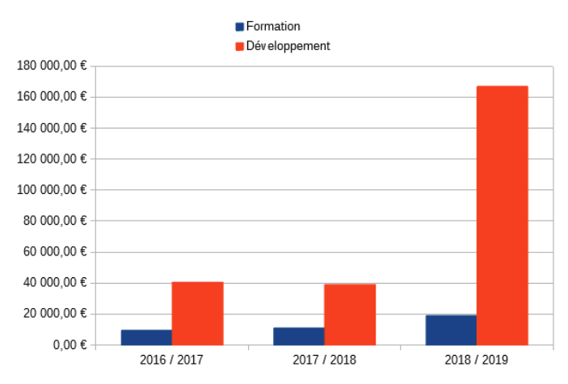
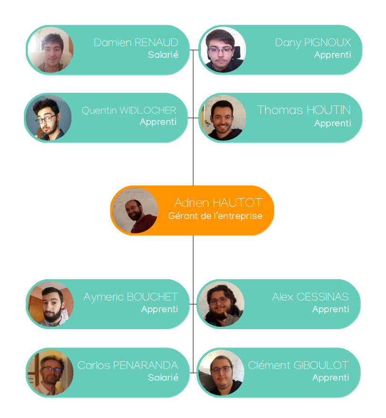

1. [Historique](#historique)
1. [Activité](#activité)
1. [Organisation](#organisation)
   1. [Organigramme](#organigramme)
1. [Placement sur le marché](#placement-sur-le-marché)
1. [Analyse concurrentielle](#analyse-concurrentielle)
1. [Forces et faiblesses](#forces-et-faiblesses)
   1. [Forces](#forces)
      1. [La philosophie](#la-philosophie)
      1. [La méthode](#la-méthode)
   1. [Faiblesses](#faiblesses)
1. [Place dans l'entreprise](#place-dans-lentreprise)
   1. [Rôles particuliers](#rôles-particuliers)
1. [Missions menées](#missions-menées)
   1. [Solvetys](#solvetys)
   1. [Pro Tech Habitat](#pro-tech-habitat)
   1. [Safran / Zodiac](#safran--zodiac)
1. [Démarche](#démarche)
1. [Résultats](#résultats)

## Historique

Au début de l'année 2016, Adrien HAUTOT crée la startup Erudo SAS à Angoulême, en Charente.\
Son activité principale est le développement de logiciels web de gestion sur-mesure pour les entreprises. Son rôle est d'assurer une évolution des systèmes de gestion informatisé de ses clients.

## Activité

En plus du développement de logiciels, Erudo délivre aussi des formations dans le secteur de l'informatique comme par exemple des formations au CESi d'Angoulême. L'entreprise forme également des professionnels aux méthodes agiles ou au langage de programmation Java par exemple.

Néanmoins la développement de logiciel reste la principale source de revenue de l’entreprise comme le montre l’évolution du chiffre d'affaire ci-dessous :

Aujourd'hui, l'entreprise compte 8 employés et dégage un chiffre d'affaire de 186 475.81€.

Ses clients sont variés et peuvent être des TPE, des PME (comme [Solvetys](https://solvetys.com/) ou [Pro Tech Habitat](https://www.protechhabitat.fr/)) ou des entreprises plus large (comme la [Smatis](https://www.smatis.fr/) ou le groupe [Safran](https://www.safran-group.com/fr)).

## Organisation

La structure d'Erudo est naturellement horizontale. Mis à part le statut d'Adrien HAUTOT le responsable de l'entreprise, la notion de hiérarchie entre les employés n'est pas réellement présente.

Malgré cela bien sûr, chaque personne possède bien souvent une affinité avec une compétence particulière et sera le plus souvent chargé de cette facette de l'entreprise. (Citons par exemple Carlos PENARANDA, qui s'occupe aujourd'hui de l'infrastructure réseau en plus du développement)

### Organigramme

## Placement sur le marché

## Analyse concurrentielle

## Forces et faiblesses

### Forces

#### La philosophie

L'une des principales force d'Erudo est sans contexte sa philosophie de travail.

En effet, là où la plupart des entreprises se basent sur la hiérarchie pour établir un climat de travail propice, Erudo fait le choix de créer ce climat avec la confiance.\
Adrien HAUTOT lui même reste développeur au même titre que ses employés, malgré ses responsabilités plus importantes et c'est cette proximité qui efface les barrières hiérarchique et favorise le partage.

En misant sur la communication avant tout, l'entreprise peut ainsi avancer non plus "à l'aide" de ses employés, mais *avec eux*.\
Cette différence joue un rôle considérable dans la vision du travail, à savoir que les employés ne sont plus motivé par le résultats du mois mais bien par l'évolution de l'entreprise elle même.

Un autre avantage de cette hiérarchie horizontale est qu'une fois sur un pied d'égalité avec les autres employés, il est plus aisé de participer en apportant des idées, en posant des questions et en cherchant à expliquer des choses.

#### La méthode

Pour tirer profit de la traction apportée par la philosophie de l'entreprise, cette dernière emploie une méthode de travail assez novatrice et tout particulièrement adapté au cœur de métier, la méthode *Scrum*.

Cette méthode (expliquée plus en détail dans le chapitre [*démarche*](#démarche)) s'appuie sur la méthodologie Agile.\
Cette méthodologie consiste à découvrir les besoins et à élaborer des solutions grâce à l'effort de collaboration d'équipes auto-organisées.\
Elle préconise une planification adaptative, un développement évolutif, une livraison rapide et une amélioration continue, et elle encourage des réponses flexibles au changement.

Pour cela bien entendu, il est crucial d'avoir du recul sur la demande et d'avoir une équipe en pleine maitrise de son domaine de travail, capable se s'auto-organiser sans un responsable de projet délégué.

C'est en cela que la méthode s'harmonise avec la philosophie pour une gestion de l'entreprise efficace et réactive.

### Faiblesses

Étant une startup, Erudo souffre bien malheureusement des mêmes menaces que les autres startup.

Tout d'abord, l'entreprise est très dépendante des contrats qu'elle est capable d'obtenir. C'est ces contrats qui lui permettent de rester à flot.\
Fort heureusement, les formations régulières et les divers contrats de maintenance proposés aux client permettent de conserver un apport régulier.

Du fait de la faible masse salariale dans l'entreprise, certaines personne occupent des rôle cruciaux et apportent un savoir faire qui pourrais disparaitre en même temps que l'employé si un jour il devait quitter l'entreprise.\
Cette problématique est constamment travaillée en interne lors de diverses sessions de partage de connaissance, ayant pour but de former chaque employé à chaque tâche qu'il est possible de réaliser dans l'entreprise. (Du développement, à la gestion de l'infrastructure réseau en passant pas la gestion des outils d'intégration)

Une autre faiblesses à noter, provient du fait qu'un grand nombre d'employés sont alternant au CESi (où sont fournies des formations rappelons le). Ces alternants donc je fait partie n'ont pas l'expérience qu'il est souvent important d'avoir dans un métier.\
Ce n'est pas pour autant qu'ils ne sont pas correctement formé et encadré par des salariés plus expérimentés.

## Place dans l'entreprise

Comme nous avons pu le dire plus tôt, au sein d'Erudo, la hiérarchie est très horizontale, si bien que chaque employé possède globalement les même missions à savoir :

- **Analyser** et **comprendre** les besoins de l'entreprise (automatisation, évolution) pour mieux proposer les solutions adéquates
- **Concevoir** des solutions logicielles sur-mesure en fonction des demandes formulées par les divers clients
- **Participer** à la réalisation et la mise en production des solutions
- **Effectuer** des tests pour vérifier le bon fonctionnement des outils et procéder aux rectifications, si nécessaire, avant de les commercialiser
- **Organiser** et **piloter** de façon Agile des projets informatiques

### Rôles particuliers

Certains employés ont aussi une spécialité dans laquelle ils sont plus compétents. Et d'autres sont plus souvent en relations avec des clients.

Parmi les spécificité que l'on peut trouver au sein de l'entreprise il y a :

- La gestion de l'infrastructure et du système d'intégration continue
- Un bonne connaissance des architectures applicative dîtes, de *frontend*
- La relation avec le propriétaire du produit (*Product Owner* ou PO)
- La mise en place de l'interface utilisateur et la réflexion autour de l’expérience d'utilisation
- La gestion de l'architecture applicative de l'application serveur

## Missions menées

Parmi les différents projets en cours à Erudo j'ai eu la chance de travailler sur trois d'entre eux.

### Solvetys

Solvetys est une société de rachat de prêt. Son rôle est de simplifier le remboursement de prêts en les rachetant aux particuliers.\
Cette société s'adresse à des personnes endettées qui veulent financer un autre projet ou à de futurs retraités qui, malgré la diminution de leurs revenus, doivent honorer leurs prêts.

En regroupant les crédits et en les étalant dans le temps, Solvetys permet à ses clients de desserrer l'étau des remboursements.

Pour Solvetys, Erudo a développé *Soluiob*, une solution de suivi et de gestion des dossiers clients pour Solvetys. C’est une refonte de la solution "Portail Solvetys" développée il y a plus de 9 ans par Adrien HAUTOT.

### Pro Tech Habitat

Pro Tech Habitat est une entreprise qui officie dans le domaine de la protection de l'habitat et de l'entretien des murs et des toitures.

L'entreprise est composé de trois groupe d'employés aux fonctions complémentaires.\
D'une part les téléprospecteurs qui démarchent téléphoniquement les clients potentiels et prévoient des rendez vous que les commerciaux pourrons honorer.\
Ces commerciaux rencontrent ces clients potentiels et établissent un devis et conviennent peut-être d'une date de début de chantier avec eux.\
C'est ensuite au tour des techniciens de mettre en place la rénovation de la maison.

Afin d'assister les téléprospecteurs et les commerciaux, Erudo a conçu *Habit'app*, une double application permettant à ces deux groupes de communiquer au mieux afin d'honorer un plus grand nombre de rendez-vous.\
D'une part l'application bureau permet aux téléprospecteurs de planifier des rendez vous et de l'autre, une application mobile permet aux commerciaux de suivre leurs rendez-vous de la journée ainsi que pouvoir remonter l'information en cas d'un contrat signé ou non.

### Safran / Zodiac

Avant le rachat par Safran l’entreprise cliente s’appelait Zodiac-Aerospace.\
Le donneur d’ordre étant une structure interne à Zodiac qui assure, auprès des compagnies aériennes un support technique pour l’entretien, la maintenance et les réparations ainsi que des services après-vente pour les produits du groupe, partout dans le monde.

Zodiac-Aerospace est organisé autour des trois principales zones (États-Unis, Europe, Asie) d’où rayonne un réseau de stations de réparation et de distribution.\
Au sein du groupe Safran le projet *Izos* s’articule autour du *DVM* ("Management visuel").

Il permet à Safran de mieux gérer les commandes naviguant au sein de leurs ateliers de réparation et à mieux gérer leurs délais.\
Le projet a pour objectif d’être déployé dans le monde entier, d’où la nécessité d'un application complétement multilingue. Il existe une seule version de l’application pour tous les ateliers.

Le logiciel de gestion permet à la fois de créer, de modifier et de suivre une commande par l’ingénieur et le chef d’atelier. Il permet aussi d’afficher un management visuel des autres commandes sur des écrans dans chaque service concerné par l’entretien.

Aujourd’hui le projet est en production pour trois ateliers répartis sur l’Europe et
l’Amérique du nord. Ce client est l’un des plus importants de l’entreprise, encore aujourd'hui.

## Démarche

<!-- [SCRUM]
est conçu pour des équipes de dix membres ou moins, qui divisent leur travail en objectifs pouvant être réalisés dans des itérations limitées dans le temps, appelées sprints, ne dépassant pas un mois et durent le plus souvent deux semaines.

L'équipe suit les progrès dans le cadre de réunions quotidiennes de 15 minutes, appelées mêlées quotidiennes. À la fin du sprint, l'équipe procède à une révision du sprint, pour démontrer le travail accompli, et à une rétrospective du sprint pour s'améliorer continuellement. -->

## Résultats

Jusqu'à présent, cette démarche s'est avérée très efficace pour gérer au mieux les projets clients. Ces derniers reçoivent très rapidement une version non complète de l'application mais un version qu'il leurs est possible d'essayer et de rapidement nous fournir des retours de correctifs et d'ajustements.

Cela nous a toujours permis de faire évoluer les projets aux besoins de nos clients plutôt que de leurs demander d'ajuster leurs utilisations. C'est une chose qui paraît contre-intuitif et cela, malgré la fréquence à laquelle cela peut arriver dans des entreprises utilisant des méthodes moins adaptés au développement de logiciels.

Cette méthode permet aussi de prévoir du temps de réflexion sur ce qui a été fait et d'en tirer sans cesse des pistes d'améliorations. Le temps de partage de connaissance et de montée en niveau des technologies nous permet d'être toujours prêts à entamer un nouveau projet dans les meilleurs conditions.

La philosophie axée sur la communication nous permet aussi de détecter et de résoudre très rapidement les frictions entre les pensées tout en permettant à chacun de s'exprimer sur son ressenti. Une grande proportion est aussi attribué à la veille technologique que nous effectuons chacun dans l'intérêt de tous les autres.

Bien sûr, il n'est pas question d'affirmer que tout se passe toujours bien, mais plutôt de reconnaitre que tout à tendance à se passer de mieux en mieux au fil des itérations que cette méthode apporte.

Pour donner un exemple, il a récemment été remarqué que notre comportement s'éloignait parfois de ce qui rend Scrum si efficace. Les objectifs des sprints n'étaient plus rappelés au début de chaque mêlées et l'on se servaient rarement du graphique *burndown* (indiquant la progression d'un sprint) dans celles ci.

Ces écarts ont étés promptement rétablis au sein de la méthode elle même car c'est lors d'une retrospective de sprint que ces écarts ont étés détecté. Cette itération a donc apporté avec elle un lot de changement qui nous ont permis de s'améliorer encore.

Sans cette capacité à se remettre fréquemment en question, la direction que l'ont prend reste toujours la même, aussi déviante de l'objectif soit-elle.