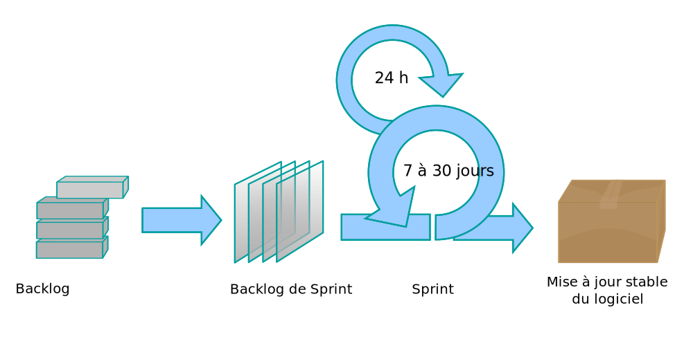

1. [Historique](#historique)
1. [Activité](#activité)
1. [Organisation](#organisation)
   1. [Organigramme](#organigramme)
1. [Placement sur le marché](#placement-sur-le-marché)
1. [Analyse concurrentielle](#analyse-concurrentielle)
   1. [La concurrence directe](#la-concurrence-directe)
      1. [SCUB](#scub)
      1. [Sodigep](#sodigep)
   1. [La concurrence indirecte](#la-concurrence-indirecte)
      1. [SOLISYS](#solisys)
1. [Forces et faiblesses](#forces-et-faiblesses)
   1. [Forces](#forces)
      1. [La philosophie](#la-philosophie)
      1. [La méthode](#la-méthode)
   1. [Faiblesses](#faiblesses)
1. [Place dans l'entreprise](#place-dans-lentreprise)
   1. [Rôles particuliers](#rôles-particuliers)
1. [Missions menées](#missions-menées)
   1. [Solvetys](#solvetys)
   1. [Pro Tech Habitat](#pro-tech-habitat)
   1. [Safran / Zodiac](#safran--zodiac)
1. [Démarche](#démarche)
   1. [La méthode Agile](#la-méthode-agile)
   1. [La méthode Scrum](#la-méthode-scrum)
      1. [Les rôles](#les-rôles)
         1. [Le Product Owner](#le-product-owner)
         1. [L'équipe de développement](#léquipe-de-développement)
         1. [Le Scrum Master](#le-scrum-master)
      1. [Les outils](#les-outils)
         1. [Les sprints](#les-sprints)
         1. [La planification de sprint](#la-planification-de-sprint)
         1. [La mêlée quotidienne](#la-mêlée-quotidienne)
         1. [La revue de sprint](#la-revue-de-sprint)
         1. [La rétrospective de sprint](#la-rétrospective-de-sprint)
   1. [Facturation](#facturation)
1. [Résultats](#résultats)

## Historique

Au début de l'année 2016, Adrien HAUTOT crée la start-up Erudo SAS à Angoulême, en Charente.\
Son activité principale est le développement de logiciels web de gestion sur-mesure pour les entreprises. Son rôle est d'assurer une évolution des systèmes de gestion informatisée de ses clients.

## Activité

En plus du développement de logiciels, Erudo délivre aussi des formations dans le secteur de l'informatique comme par exemple des formations au CESi d'Angoulême. L'entreprise forme également des professionnels aux méthodes agiles ou au langage de programmation Java par exemple.

Néanmoins le développement de logiciels reste la principale source de revenus de l’entreprise comme le montre l’évolution du chiffre d'affaires ci-dessous :

Aujourd'hui, l'entreprise compte 8 employés et dégage un chiffre d'affaires de 186 476 €.

Ses clients sont variés et peuvent être des TPE, des PME (comme [Solvetys](https://solvetys.com/) ou [Pro Tech Habitat](https://www.protechhabitat.fr/)) ou des entreprises plus large (comme la [Smatis](https://www.smatis.fr/) ou le groupe [Safran](https://www.safran-group.com/fr)).

## Organisation

La structure d'Erudo est naturellement horizontale. Mis à part le statut d'Adrien HAUTOT le responsable de l'entreprise, la notion de hiérarchie entre les employés n'est pas réellement présente.

Malgré cela bien sûr, chaque personne possède bien souvent une affinité avec une compétence particulière et sera le plus souvent chargé de cette facette de l'entreprise. (Citons par exemple Carlos PENARANDA, qui s'occupe aujourd'hui de l'infrastructure réseau en plus du développement)

### Organigramme

## Placement sur le marché

Erudo est une entreprise de développement de logiciels métiers sur-mesure comme il en existe plusieurs, y compris à Angoulême.

Afin de se positionner au mieux, l'accent est mis (comme au sein de l'entreprise elle-même) sur la communication avec le client, et ce que l'on appelle fréquemment le "feeling".\
En effet, Erudo tire parti de sa faible envergure pour se placer au plus près des clients et de leurs besoins.

C'est dans le dialogue fréquent et efficace que la confiance peut s'établir et durer. Actuellement, les seuls clients d'Erudo viennent d'un démarchage actif.

Cependant, récemment l'accent a été mis sur la communication de l'entreprise au "grand public" lors de la refonte du site internet [erudo.fr](https://www.erudo.fr/) et par là même, de l'aspect graphique de l'entreprise.\
Dans cette communication se place encore et toujours cette notion de proximité et de dialogue qui fait la particularité d'Erudo par rapport aux entreprises de développement concurrentes.

## Analyse concurrentielle

Afin d'analyser au mieux la concurrence d'Erudo, citons à nouveau les valeurs, les objectifs et les propositions de l'entreprise.

Tout d'abord, Erudo propose :

- Des solutions logicielles sur mesure
- Une approche *Agile* de la gestion de projet
- Des formations aux écoles et aux professionnels

L'entreprise s'adresse donc :

- Aux TPE et PME pour des logiciels de gestions
- Aux TPE et PME pour des formations techniques
- Aux écoles de programmation
- Aux écoles de gestion de projets (informatique ou non)

Elle met en avant :

- Sa communication directe et ses relations très proches de l'utilisateur final (et donc du besoin)
- Son approche Agile et sa capacité à livrer au plus vite les fonctionnalités essentielles
- Sa polyvalence quant à la nature des logiciels qu'elle est capable de fournir
  - ERP (Progiciel de gestion intégrée)
  - DMS (Gestion électronique de documents)
  - CRM (Gestion de la relation client)
  - Applications mobiles
  - Logiciels de tarification
  - Etc.

### La concurrence directe

#### SCUB

SCUB est une entreprise de développement de logiciel sur-mesure basée à Angoulême mais présente à Bordeaux et à Paris. Elle compte près de 9 salariés et a réalisé un chiffre d'affaires de 1 365 500 € en 2016.

Elle propose comme Erudo des logiciels sur mesure, développés selon une approche Agile.\
Cependant, la livraison des produits de SCUB est réalisé selon une méthode de cycle en V, à savoir que le produit final n'est livré qu'une fois le développement finalisé.
Elle ne propose pas de formations (ni techniques, ni de gestion de projet).

SCUB s'adresse donc principalement aux PME et met en avant la qualité de leurs logiciels reconnus par des labels (Finance Innovation par exemple).\
Ils mettent aussi en avant leur approche Agile du développement permettant aux clients de suivre l'avancement du projet.

#### Sodigep

Sodigep est une entreprise de développement d'ERP basé à Angoulême, comptant trois salariés. Elle a réalisé un chiffre d'affaires de 258 700 € en 2017.

La proposition de Sodigep s'axe sur son logiciel de gestion intégré, vendu en l'état puis adapté aux besoins de l'entreprise cliente.

L'entreprise s'adresse au TPE et PME et met en avant l'étendue de son logiciel de gestion, ainsi que la personnalisation de ce dernier.

### La concurrence indirecte

#### SOLISYS

SOLISYS est une société par actions simplifiée de développement de logiciels basé à Clermont-Ferrand comptant trois salariés.

Elle propose des solutions informatiques de télégestion, de modélisation d'infrastructure et de gestion d'exploitation. Contrairement à Erudo, ces solutions sont existantes et ne font pas partie d'un développement sur mesure, si ce n'est la mise en place.

SOLISYS vise principalement les PME en mettant en avant les nouvelles technologies comme la BI (*Business Intelligence*, informatique décisionnelle), le Big Data ou l'IoT (*Internet of Things*, objets connectés).

## Forces et faiblesses

### Forces

#### La philosophie

L'une des principales force d'Erudo est sans conteste sa philosophie de travail.

En effet, là où la plupart des entreprises se basent sur la hiérarchie pour établir un climat de travail propice, Erudo fait le choix de créer ce climat avec la confiance.\
Adrien HAUTOT lui-même reste développeur au même titre que ses employés, malgré ses responsabilités plus importantes et c'est cette proximité qui efface les barrières hiérarchiques et favorise le partage.

En misant sur la communication avant tout, l'entreprise peut ainsi avancer non plus "à l'aide" de ses employés, mais *avec eux*.\
Cette différence joue un rôle considérable dans la vision du travail, à savoir que les employés ne sont plus motivé par les résultats du mois mais bien par l'évolution de l'entreprise elle-même.

Un autre avantage de cette hiérarchie horizontale est qu'une fois sur un pied d'égalité avec les autres employés, il est plus aisé de participer en apportant des idées, en posant des questions et en cherchant à expliquer des choses.

#### La méthode

Pour tirer profit de la traction apportée par la philosophie de l'entreprise, cette dernière emploie une méthode de travail assez novatrice et tout particulièrement adaptée au cœur de métier, la méthode *Scrum*.

Cette méthode (expliquée plus en détail dans le chapitre [*démarche*](#démarche)) s'appuie sur la méthodologie Agile.\
Cette méthodologie consiste à découvrir les besoins et à élaborer des solutions grâce à l'effort de collaboration d'équipes auto-organisées.\
Elle préconise une planification adaptative, un développement évolutif, une livraison rapide et une amélioration continue, et elle encourage des réponses flexibles au changement.

Pour cela bien entendu, il est crucial d'avoir du recul sur la demande et d'avoir une équipe en pleine maitrise de son domaine de travail, capable de s'auto-organiser sans un responsable de projet délégué.

C'est en cela que la méthode s'harmonise avec la philosophie pour une gestion de l'entreprise efficace et réactive.

### Faiblesses

Étant une start-up, Erudo souffre bien malheureusement des mêmes menaces que les autres start-up.

Tout d'abord, l'entreprise est très dépendante des contrats qu'elle est capable d'obtenir. C'est ces contrats qui lui permettent de rester à flot.\
Fort heureusement, les formations régulières et les divers contrats de maintenance proposés aux clients permettent de conserver un apport régulier.

Du fait de la faible masse salariale de l'entreprise, certaines personnes occupent des rôles cruciaux et apportent un savoir-faire qui pourrait disparaitre en même temps que l'employé si un jour il devait quitter l'entreprise.\
Cette problématique est constamment travaillée en interne lors de diverses sessions de partage de connaissance, ayant pour but de former chaque employé à chaque tâche qu'il est possible de réaliser dans l'entreprise. (Du développement, à la gestion de l'infrastructure réseau en passant pas la gestion des outils d'intégration)

Une autre faiblesse à noter, provient du fait qu'un grand nombre d'employés sont alternants au CESi (où sont fournies des formations rappelons-le). Ces alternants dont je fais partie n'ont pas l'expérience qu'il est souvent important d'avoir dans un métier.\
Ce n'est pas pour autant qu'ils ne sont pas correctement formés et encadrés par des salariés plus expérimentés.

## Place dans l'entreprise

Comme nous avons pu le dire plus tôt, au sein d'Erudo, la hiérarchie est très horizontale, si bien que chaque employé possède globalement les mêmes missions à savoir :

- **Analyser** et **comprendre** les besoins de l'entreprise (automatisation, évolution) pour mieux proposer les solutions adéquates
- **Concevoir** des solutions logicielles sur-mesure en fonction des demandes formulées par les divers clients
- **Participer** à la réalisation et la mise en production des solutions
- **Effectuer** des tests pour vérifier le bon fonctionnement des outils et procéder aux rectifications, si nécessaire, avant de les commercialiser
- **Organiser** et **piloter** de façon Agile des projets informatiques

### Rôles particuliers

Certains employés ont aussi une spécialité dans laquelle ils sont plus compétents. Et d'autres sont plus souvent en relations avec des clients.

Parmi les spécificités que l'on peut trouver au sein de l'entreprise il y a :

- La gestion de l'infrastructure et du système d'intégration continue
- Un bonne connaissance des architectures applicative
- La relation avec le propriétaire du produit (*Product Owner* ou PO)
- La mise en place de l'interface utilisateur et la réflexion autour de l’expérience d'utilisation
- La gestion de l'architecture applicative de l'application serveur

## Missions menées

Parmi les différents projets en cours à Erudo j'ai eu la chance de travailler sur trois d'entre eux.

### Solvetys

Solvetys est une société de rachat de prêt. Son rôle est de simplifier le remboursement de prêts en les rachetant aux particuliers.\
Cette société s'adresse à des personnes endettées qui veulent financer un autre projet ou à de futurs retraités qui, malgré la diminution de leurs revenus, doivent honorer leurs prêts.

En regroupant les crédits et en les étalant dans le temps, Solvetys permet à ses clients de desserrer l'étau des remboursements.

Pour Solvetys, Erudo a développé *Soluiob*, une solution de suivi et de gestion des dossiers clients. C’est une refonte de la solution "Portail Solvetys" développée il y a plus de 9 ans par Adrien HAUTOT.

### Pro Tech Habitat

Pro Tech Habitat est une entreprise qui officie dans le domaine de la protection de l'habitat et de l'entretien des murs et des toitures.

L'entreprise est composé de trois groupes d'employés aux fonctions complémentaires.\
D'une part les téléprospecteurs qui démarchent téléphoniquement les clients potentiels et prévoient des rendez-vous que les commerciaux pourront honorer.\
Ces commerciaux rencontrent ces clients potentiels et établissent un devis et conviennent peut-être d'une date de début de chantier avec eux.\
C'est ensuite au tour des techniciens de mettre en place la rénovation de la maison.

Afin d'assister les téléprospecteurs et les commerciaux, Erudo a conçu *Habit'app*, une double application permettant à ces deux groupes de communiquer au mieux afin d'honorer un plus grand nombre de rendez-vous.\
D'une part l'application bureau permet aux téléprospecteurs de planifier des rendez-vous et de l'autre, une application mobile permet aux commerciaux de suivre leurs rendez-vous de la journée ainsi que pouvoir remonter l'information en cas d'un contrat signé ou non.

### Safran / Zodiac

Avant le rachat par Safran, l’entreprise cliente s’appelait Zodiac-Aerospace.\
Le donneur d’ordre étant une structure interne à Zodiac qui assure, auprès des compagnies aériennes un support technique pour l’entretien, la maintenance et les réparations ainsi que des services après-vente pour les produits du groupe, partout dans le monde.

Zodiac-Aerospace est organisé autour des trois principales zones (États-Unis, Europe, Asie) d’où rayonne un réseau de stations de réparation et de distribution.\
Au sein du groupe Safran le projet *Izos* s’articule autour du *DVM* ("Management visuel").

Il permet à Safran de mieux gérer les commandes naviguant au sein de leurs ateliers de réparation et à mieux gérer leurs délais.\
Le projet a pour objectif d’être déployé dans le monde entier, d’où la nécessité d'une application complètement multilingue. Il existe une seule version de l’application pour tous les ateliers.

Le logiciel de gestion permet à la fois de créer, de modifier et de suivre une commande par l’ingénieur et le chef d’atelier. Il permet aussi d’afficher un management visuel des autres commandes sur des écrans dans chaque service concerné par l’entretien.

Aujourd’hui le projet est en production pour trois ateliers répartis sur l’Europe et
l’Amérique du nord. Ce client est l’un des plus importants de l’entreprise, encore aujourd'hui.

## Démarche

### La méthode Agile

Le développement de logiciels agile fait référence à des approches dans le processus qui augmentent la transparence et la vitesse de changement dans le but de conduire à un déploiement plus rapide. Cette approche permet de minimiser les risques et les opérations inutiles dans le processus de développement.

Cette méthode doit être coordonnée avec le client à intervalles réguliers et courts.\
Cela permet de répondre avec souplesse aux exigences des clients afin d'accroître leur satisfaction globale. Le développement logiciel agile se caractérise par des équipes auto-organisées et une approche itérative et incrémentale.

la méthode a été popularisée par le "Manifeste pour le développement Agile de logiciels[^1]". Les quatre valeurs et les douze principes proposés dans ce manifeste ont été dérivés et ont donné lieu à un large éventail de cadres de développement logiciel, comme par exemple *Scrum* et *Kanban*.

Afin de saisir au mieux la mentalité de cette méthode, voici les quatre valeurs "piliers" de cette dernière. Il faut valoriser :

- Les individus et leurs interactions plus que les processus et les outils
- Des logiciels opérationnels plus qu’une documentation exhaustive
- La collaboration avec les clients plus que la négociation contractuelle
- L’adaptation au changement plus que le suivi d’un plan

Le manifeste rappelle bien entendu qu'il faut "reconnaitre la valeur des seconds éléments, mais privilégier les premiers".

### La méthode Scrum

Scrum est un ensemble de règles et d'outils basé sur la méthode Agile. La méthode est conçue pour des équipes de dix membres ou moins, qui divisent leur travail en objectifs pouvant être réalisés dans des itérations limitées dans le temps, appelées sprints, ne dépassant pas un mois et durent le plus souvent deux semaines.

L'équipe suit les progrès dans le cadre de réunions quotidiennes de 15 minutes, appelées mêlées quotidiennes. À la fin du sprint, l'équipe procède à une révision du sprint, pour démontrer le travail accompli, et à une rétrospective du sprint pour s'améliorer continuellement.

Un principe clé de Scrum est la reconnaissance du fait que les clients changeront d'avis sur ce qu'ils veulent ou ce dont ils ont besoin et qu'il y aura des défis imprévisibles pour lesquels une approche prédictive ou planifiée n'est pas adaptée.\
C'est pourquoi Scrum adopte une approche empirique fondée sur des preuves en acceptant que le problème ne puisse pas être entièrement compris ou défini d'emblée, et en se concentrant plutôt sur la manière de maximiser la capacité de l'équipe à livrer rapidement, à répondre aux nouvelles exigences et à s'adapter à l'évolution des technologies et aux changements des conditions du marché.

Scrum comprend trois rôles, qui sont idéalement situés aux même endroits physiques pour assurer une communication optimale entre les membres de l'équipe.\
Là où de nombreuses organisations ont d'autres rôles impliqués dans la définition et la livraison du produit, Scrum ne définit que ces trois rôles.

#### Les rôles

##### Le Product Owner

Le *Product Owner* (PO), ou en français le propriétaire du produit, représente les parties prenantes du produit et la voix du client.

Il définit le produit en termes compréhensibles pour le client (généralement des témoignages d'utilisateurs appelés *User Stories*), les ajoute à une liste de tâche à effectuer (appelés *Backlog*) et les classe par ordre de priorité en fonction de leur importance.

Une équipe Scrum doit avoir un seul *product owner* qui ne doit pas dicter à l'équipe comment parvenir à une solution technique, mais doit chercher à obtenir un consensus parmi les membres de l'équipe.\
Un bon *product owner* doit être capable de communiquer ce dont l'entreprise a besoin, de demander pourquoi elle en a besoin et de transmettre le message à toutes les parties prenantes, y compris l'équipe de développement.

##### L'équipe de développement

L'équipe de développement est composée de trois à neuf membres qui effectuent toutes les tâches nécessaires pour augmenter la production de valeur à chaque sprint.

Bien que les membres de l'équipe soient souvent appelés "développeurs", le terme désigne toute personne qui joue un rôle dans le développement et le soutien du système ou du produit (designers, spécialistes des données, statisticiens, analystes, ingénieurs, programmeurs, testeurs etc.)

L'équipe de développement doit être auto-organisée. Bien qu'aucun travail ne doive parvenir à l'équipe sans passer par le *product owner*, et que le *scrum master* soit censé protéger l'équipe d'une trop grande distraction, l'équipe doit tout de même être encouragée à interagir directement avec les clients et/ou les parties prenantes afin d'obtenir une compréhension maximale et un retour d'information immédiat.

##### Le Scrum Master

La méthode Scrum est facilitée par un *Scrum Master* (littéralement "maître de mêlée"), qui vise à éliminer les obstacles à la capacité de l'équipe à atteindre les objectifs.

Le *scrum master* n'est pas un chef d'équipe ou un chef de projet traditionnel, mais il agit comme un tampon entre l'équipe et toute influence perturbatrice. Il veille à ce que le cadre de la méthode soit respecté.

L'une des différences entre le rôle de *scrum master* et celui de chef de projet est que ce dernier peut avoir des responsabilités de gestion du personnel là où le *scrum master* n'en a pas.

Un *scrum master* fournit une quantité limitée de directives puisque l'équipe est censée être autonome et s'auto-organiser. Scrum ne reconnaît pas formellement le rôle de gestionnaire de projets, car les tendances traditionnelles de commandement et de contrôle causeraient des difficultés.

#### Les outils

La méthode Scrum propose aussi de nombreux outils essentiels à sa bonne application.

##### Les sprints

Un sprint (également appelé itération) est l'unité de base du développement dans Scrum.\
C'est un effort chronométré, à savoir que la durée est convenue et fixée à l'avance pour chaque sprint et se situe normalement entre une semaine et un mois, deux semaines étant le plus courant.

Chaque sprint commence par une planification afin d'établir un objectif de sprint. Ces sprints se terminent par une revue et une rétrospective, qui passe en revue les progrès réalisés pour les montrer aux parties prenantes et tirer des leçons et des améliorations pour les sprints suivants.

Scrum met l'accent sur les résultats utiles à la fin du sprint. Dans le cas du développement de logiciels, cela signifie par exemple que le logiciel a été entièrement intégré, testé et documenté, et qu'il est potentiellement possible de le livrer.

##### La planification de sprint

Au début d'un sprint, l'équipe Scrum organise une planification du sprint pour discuter et convenir mutuellement de l'étendue du travail qui doit être effectué pendant ce sprint.

Cette planification permet aussi de préparer un *backlog* de sprint qui comprend le travail nécessaire pour terminer les éléments du backlog de produits sélectionnés, de convenir de l'objectif du sprint (une brève description de ce qu'il est prévu de livrer à la fin du sprint). La durée recommandée d'une planification de sprint est de quatre heures pour un sprint de deux semaines.

Au cours de la première moitié, toute l'équipe Scrum (équipe de développement, *scrum master* et *product owner*) sélectionne les éléments du *backlog* qui, selon elle, pourraient être réalisés dans ce sprint.

Dans la seconde moitié, l'équipe de développement identifie les tâches nécessaires pour achever ces éléments du backlog du produit pour aboutir à un backlog de sprint.\
Au fur et à mesure, certains éléments du *backlog* peuvent être divisés ou remis dans le *backlog* si l'équipe ne pense plus pouvoir terminer le travail requis en un seul sprint.

##### La mêlée quotidienne

Chaque jour, lors d'un sprint, l'équipe organise une mêlée quotidienne (appelé aussi stand-up) avec des directives spécifiques. Tous les membres de l'équipe de développement viennent préparés.

La mêlée quotidienne commence précisément à l'heure, même si certains membres de l'équipe de développement sont absents. Elle doit se dérouler au même moment et au même endroit chaque jour et est limitée à quinze minutes.

Tout le monde est le bienvenu, mais seuls les membres de l'équipe de développement doivent contribuer. Lors de la mêlée quotidienne, chaque membre de l'équipe répond généralement à trois questions :

- Qu'ai-je fait hier qui a contribué à ce que l'équipe atteigne l'objectif de sprint ?
- Qu'est-ce que je compte faire aujourd'hui pour y contribuer ?
- Est-ce que je vois un obstacle qui pourrait m'empêcher, moi ou l'équipe, d'atteindre cet objectif ?

Tout obstacle (par exemple : risque, problème, dépendance des tâches, hypothèse non fondée) identifié dans la mêlée quotidienne doit être noté par le *scrum master* et affiché sur le tableau de mêlée de l'équipe. Une personne doit être désignée pour travailler à une résolution.

Aucune discussion détaillée ou technique ne doit avoir lieu lors de la mêlée quotidienne.\ Une fois la réunion terminée, les membres peuvent se réunir pour discuter des questions en détail.

##### La revue de sprint

Lors de la revue du sprint à la fin de ce dernier, l'équipe passe en revue le travail accompli et le travail prévu qui n'a pas été achevé. Elle présente le travail achevé aux parties prenantes lors d'une démonstration et collabore avec elles sur ce qu'il faut faire ensuite.

Lors d'une revue, un travail incomplet ne peut être montré. La durée recommandée est de deux heures pour un sprint de deux semaines.

##### La rétrospective de sprint

Lors de la rétrospective du sprint, l'équipe réfléchit sur le sprint passé et identifie et convient d'actions pour améliorer les processus. Le *scrum master* a pour objectif de faciliter cette démarche.

Trois questions principales se posent dans la rétrospective du sprint :

- Que c'est il bien passé pendant le sprint ?
- Que ne c'est il pas bien passé ?
- Qu'est-ce qui pourrait être amélioré pour une meilleure productivité lors du prochain sprint ?
  
La durée recommandée est d'une heure et demie pour un sprint de deux semaines.

### Facturation

Un problème résultant de l'utilisation de la méthode Agile est qu'il est parfois difficile pour un client de savoir à l'avance combien il devra payer pour son produit. Erudo a donc mis en place un système appelé "pack de jours".

L'équipe estime en amont le temps de réalisation de toutes ou parties des tâches du projet et c'est ce temps estimé qui sera finalement facturé au client et non le temps réellement passé. Cette nuance motive (et oblige) l'entreprise à affiner ses estimations et à appliquer au mieux la méthode Scrum.

Les packs de jours sont vendus aux clients (souvent par lot de 50 jours/hommes) et ce dernier est libre de dépenser ses "jours" à son bon vouloir sur les fonctionnalités qui l'intéresse.

Une fois un pack épuisé, le client est libre ou non d'en acheter un autre suivant ses besoins ou s'il considère le projet comme étant suffisamment avancé.

## Résultats

Jusqu'à présent, cette démarche s'est avérée très efficace pour gérer au mieux les projets clients. Ces derniers reçoivent très rapidement une version non complète de l'application mais une version qu'il leur est possible d'essayer et de rapidement fournir des retours de correctifs et d'ajustements.

Cela nous a toujours permis de faire évoluer les projets aux besoins de nos clients plutôt que de leur demander d'ajuster leur utilisation. C'est une chose qui paraît contre-intuitive et cela, malgré la fréquence à laquelle cela peut arriver dans des entreprises utilisant des méthodes moins adaptées au développement de logiciels.

Cette méthode permet aussi de prévoir du temps de réflexion sur ce qui a été fait et d'en tirer sans cesse des pistes d'améliorations. Le temps de partage de connaissance et de montée en niveau des technologies nous permet d'être toujours prêts à entamer un nouveau projet dans les meilleures conditions.

La philosophie axée sur la communication nous permet aussi de détecter et de résoudre très rapidement les frictions entre les pensées tout en permettant à chacun de s'exprimer sur son ressenti. Une grande proportion est aussi attribuée à la veille technologique que nous effectuons chacun dans l'intérêt de tous les autres.

Bien sûr, il n'est pas question d'affirmer que tout se passe toujours bien, mais plutôt de reconnaitre que tout a tendance à se passer de mieux en mieux au fil des itérations que cette méthode apporte.

Pour donner un exemple, il a récemment été remarqué que notre comportement s'éloignait parfois de ce qui rend Scrum si efficace. Les objectifs des sprints n'étaient plus rappelés au début de chaque mêlée et l'on se servaient rarement du graphique *burndown* (indiquant la progression d'un sprint) dans celles-ci.

Ces écarts ont étés promptement rétablis au sein de la méthode elle-même car c'est lors d'une rétrospective de sprint que ces écarts ont été détectés. Cette itération a donc apporté avec elle un lot de changement qui nous ont permis de s'améliorer encore.

Sans cette capacité à se remettre fréquemment en question, la direction que l'on prend reste toujours la même, aussi déviante de l'objectif soit-elle.

[^1]: [Agile Manifesto](https://agilemanifesto.org/iso/fr/manifesto.html)
